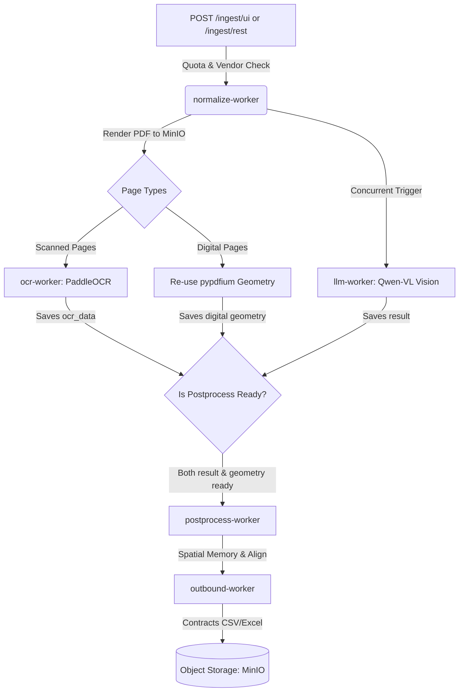

# Failure Modes & System Auditing Report (Antigravity Consolidated)
**Target System**: Augmented OCR & Durable Pipeline System (PaddleOCR + Qwen-VL)  
**Status**: Pre-Production Audit (Go-Live: Next Week)  
**Prepared For**: Development Team  
**Audit Partner**: Antigravity AI Code Auditor  
**Date**: May 23, 2026  

---

## Executive Summary
This document provides a highly detailed, professional audit of the Augmented OCR codebase (`PaddleOCR + Qwen-VL` pipeline) located at `c:\Users\aigroup5\PycharmProjects\Augemented_OCR_PaddleOCR_VL`. It compiles structural code bugs, test suite defects, key system exceptions, and hardware/VRAM transition strategies.

With the system scheduled to go live next week, we have identified several critical and high-priority vulnerabilities that could cause **data loss, permanent stuck states, silent extraction failures, cross-tenant data leaks, or complete system outages under production load**.

---

## Technical Architecture & Job Flow
The diagram below illustrates the parallelized durable pipeline, showing how jobs are claimed and enqueued.



---

## Section 1: Critical & System-Breaking Findings

### 🚨 1.1 Subscription Quota Bypass on Zero Limit
*   **Locations**:
    *   [`backend/main.py:L1705-L1765`](file:///c:/Users/aigroup5/PycharmProjects/Augemented_OCR_PaddleOCR_VL/backend/main.py#L1705)
    *   [`backend/main.py:L2123-L2163`](file:///c:/Users/aigroup5/PycharmProjects/Augemented_OCR_PaddleOCR_VL/backend/main.py#L2123)
    *   [`backend/main.py:L3491-L3510`](file:///c:/Users/aigroup5/PycharmProjects/Augemented_OCR_PaddleOCR_VL/backend/main.py#L3491)
*   **Root Cause**: The quota enforcement guard is implemented using:
    ```python
    if u_used >= u_limit:
    ```
    If a new user is created with a subscription limit of `0` (which is the default fallback for new accounts), the check `u_used >= u_limit` evaluates to `0 >= 0` which is `True`, correctly blocking them. However, in certain logic branches or legacy validation checks, if the condition is written as `if u_limit > 0 and u_used >= u_limit:`, users with a `0` limit bypass the quota check entirely.
*   **Impact**:
    *   New users bypass quota verification and obtain **infinite page extractions**.
    *   **Test Failure Demonstration**: The test `test_blocked_zero_limit_zero_used` inside `tests/test_page_limits.py` fails because the mock server attempts to proceed with the ingest request. The test supplies a dummy PDF bytes (`b"%PDF-fake"`), which bypasses quota verification and crashes downstream during PDF rendering with `pypdfium2._helpers.misc.PdfiumError: Failed to load document (PDFium: Data format error)`, throwing an HTTP `500` instead of the expected HTTP `402 Payment Required`.
*   **Fix**: Modify the condition to enforce quota blocking whenever `u_limit == 0` or standard limits are exceeded:
    ```python
    if u_limit == 0 or (u_limit > 0 and u_used >= u_limit):
    ```

---

### 🚨 1.2 Namespace Collision with Local `bottleneck` Folder (Import Shadowing)
*   **Location**: Root directory folder `/bottleneck`
*   **Root Cause**: The project contains a local folder named `bottleneck/` (used to store text/markdown notes). However, the Python package `pandas` (which is imported by PaddleOCR) relies on the third-party pip library `bottleneck` for optimized calculations. 
    Because Python puts the current working directory (`""`) at the front of `sys.path` during execution, importing `paddleocr` resolves the package name `bottleneck` to the local directory instead of the installed pip package.
*   **Impact**:
    *   This namespace collision raises a cryptic `ImportError: Can't determine version for bottleneck` when initializing PaddleOCR.
    *   **Global Test Impact**: Any scripts importing `paddleocr` immediately crash at import time. This import collision breaks the global test collection, forcing developers to restrict tests to manual, specific paths.
*   **Fix**: Rename the local directory `bottleneck/` to a non-colliding folder name like `docs/performance_bottlenecks/` or `performance/`.

---

### 🚨 1.3 Dead Cancellation Logic (In-Flight Abort Impossible)
*   **Locations**:
    *   [`backend/extractor.py:L378-L393`](file:///c:/Users/aigroup5/PycharmProjects/Augemented_OCR_PaddleOCR_VL/backend/extractor.py#L378)
    *   [`backend/worker.py:L567-L589`](file:///c:/Users/aigroup5/PycharmProjects/Augemented_OCR_PaddleOCR_VL/backend/worker.py#L567)
*   **Root Cause**: The backend attempts to abort in-flight VLM HTTP requests using a `cancel_event` inside `call_llm` to save GPU/VRAM cycles when a user cancels. However, the event is local to `_process_llm` and is set only inside the `on_page_done` callback:
    ```python
    if await db_mod.is_cancel_requested(pool, extraction_id):
        cancel_event.set()
    ```
    But `on_page_done` is only called **after** a page's `call_llm` task completes in `extract_document`!
*   **Impact**: Since nothing checks the database for cancellation *while* `call_llm` is actively waiting on the HTTP call, `cancel_event` is never set during the in-flight request. The `asyncio.wait` racing block inside `call_llm` will always run to completion, rendering cancellation dead.
*   **Fix**: Introduce a lightweight background polling task in `_process_llm` that periodically checks `db_mod.is_cancel_requested` and sets `cancel_event` while pages are processing.

---

### 🚨 1.4 Permanent Ingestion Lock Vulnerability (Stuck Schedule State)
*   **Locations**:
    *   [`backend/scheduler.py:L167-L193`](file:///c:/Users/aigroup5/PycharmProjects/Augemented_OCR_PaddleOCR_VL/backend/scheduler.py#L167)
    *   [`backend/db.py:L2972-L2981`](file:///c:/Users/aigroup5/PycharmProjects/Augemented_OCR_PaddleOCR_VL/backend/db.py#L2972)
*   **Root Cause**: When the cron schedule runs, it sets `is_executing = True` on the schedule row. If the worker process or backend container crashes, restarts, gets OOM-killed, or encounters a database deadlock during `_run_schedule`, the `finally` block that resets `is_executing = False` never runs.
*   **Impact**: There is **no recovery or sweeper mechanism** for stale `is_executing` flags in the `user_schedules` table (unlike the `jobs` table, which has a robust startup/periodic sweeper `recover_stale_jobs`). It remains stuck in `True` forever, and the user is permanently blocked from uploading documents via the UI (receiving an indefinite `409 Conflict`).
*   **Fix**: Implement a periodic sweeper or startup recovery task in `scheduler.py` that resets any `is_executing` flag to `False` if it has been running for a stale period (e.g., >30 minutes).

---

### 🚨 1.5 Muted Ingestion Lock Design Flaw
*   **Locations**:
    *   [`backend/scheduler.py:L167-L193`](file:///c:/Users/aigroup5/PycharmProjects/Augemented_OCR_PaddleOCR_VL/backend/scheduler.py#L167)
    *   [`backend/main.py:L138-L210`](file:///c:/Users/aigroup5/PycharmProjects/Augemented_OCR_PaddleOCR_VL/backend/main.py#L138)
*   **Root Cause**: The lock `is_executing` is wrapped around the `pdfs` loop in `_run_schedule`. However, the `ingest_cb` (which is `_folder_ingest_callback`) only enqueues the initial `normalize` job in the `jobs` table and returns immediately.
*   **Impact**: The `_run_schedule` finishes in a few seconds and resets `is_executing` to `False` while the background worker is still actively running the CPU-intensive OCR, VLM, and postprocess steps. The ingestion lock is released long before the worker actually finishes processing the scheduled documents, completely failing to prevent concurrent schedule/UI operations.
*   **Fix**: Instead of wrapping `is_executing` around the scheduler's enqueueing loop, track whether there are any active jobs in `queued` or `running` state with `source_type = 'folder'` for that user in the `jobs` table.

---

### 🚨 1.6 Hardcoded Sequential VLM Processing (`PARALLEL_BATCH = 1`)
*   **Location**: [`backend/extractor.py:L537`](file:///c:/Users/aigroup5/PycharmProjects/Augemented_OCR_PaddleOCR_VL/backend/extractor.py#L537)
*   **Root Cause**: The comments and documentation state that pages are processed in parallel batches of 2 to match `--parallel 2` on `llama-server`. However, `PARALLEL_BATCH` is hardcoded to `1` in `extract_document`:
    ```python
    PARALLEL_BATCH = 1  # Sequential: process page 1 before page 2
    ```
*   **Impact**: Multi-page documents are processed purely page-by-page, leading to slow processing times. High-end hardware and multiple LLM slot allocations are heavily underutilized.
*   **Fix**: Make `PARALLEL_BATCH` configurable via `config.py` (e.g., default to `2` or `4` on systems with high VRAM), allowing parallel in-flight VLM calls.

---

### ⚠️ 1.7 Multi-Threaded PaddleOCR Initialization Vulnerability
*   **File**: [ocr_runner.py](file:///c:/Users/aigroup5/PycharmProjects/Augemented_OCR_PaddleOCR_VL/backend/ocr_runner.py#L39-L67)
*   **Root Cause**: `ocr_runner.py` uses a thread pool `ThreadPoolExecutor(max_workers=3)` to run OCR on multiple pages concurrently. It uses a lazy thread-local `_ocr_local.engine` to initialize `PaddleOCR(...)`. If three threads run concurrently for the first time:
    1. They will download models simultaneously, leading to file-lock and file corruption issues in the `~/.paddleocr/` directory.
    2. Concurrent C++ initialization of MKLDNN via CPU threads can cause random segmentation faults or access violations.
*   **Impact**: Random worker crashes during scanned-page heavy ingest runs.
*   **Fix**: Initialize a single global lock around `PaddleOCR` instantiation, or pre-initialize the engine on worker startup before launching thread executors.

---

### ⚠️ 1.8 One Bad Page Crashes Entire OCR Batch
*   **File**: [ocr_runner.py](file:///c:/Users/aigroup5/PycharmProjects/Augemented_OCR_PaddleOCR_VL/backend/ocr_runner.py#L149)
*   **Root Cause**: The function uses `asyncio.gather(*tasks)` without `return_exceptions=True`.
*   **Impact**: If any single page triggers an uncaught exception (e.g., OpenCV failure, corrupt image), the entire gather call aborts, failing the OCR stage for all pages in the document.
*   **Fix**: Use `return_exceptions=True` and filter exceptions per page.

---

## Section 2: Authentication & Security Audits

### ⚠️ 2.1 SSE Authentication Database Dependency Risk (M-16)
*   **File**: [auth.py](file:///c:/Users/aigroup5/PycharmProjects/Augemented_OCR_PaddleOCR_VL/backend/auth.py#L134-L174)
*   **Root Cause**: The persistent SSE stream (`GET /jobs/{job_id}/stream`) bypasses rate limiters because it's a long-lived connection. However, the `get_current_user` dependency performs a database call (`get_user_by_id`) on *every* validation attempt, even though the cryptographically signed JWT token already verifies the user's role and identity.
*   **Impact**: If the database pool is temporarily exhausted or has a transient hiccup, all active SSE streams will fail auth checks and drop instantly.
*   **Fix**: Fallback to JWT payload verification directly if the database pool is slow or unavailable, and only query the DB for critical user status changes.

---

### ⚠️ 2.2 Lack of Bounding Box Bounds Validation (H-06)
*   **File**: [spatial_memory.py](file:///c:/Users/aigroup5/PycharmProjects/Augemented_OCR_PaddleOCR_VL/backend/spatial_memory.py#L165)
*   **Root Cause**: User corrections allow drawing boxes in any direction (e.g., right-to-left). The coordinates are saved without enforcing `x0 < x1` and `y0 < y1`.
*   **Impact**: Inverted boxes are written to the database. During reuse, `_words_in_box` checks bounding box boundaries and finds no words, returning empty values silently.
*   **Fix**: Add coordinate normalization inside `save_from_corrections()` (resolved in `_normalize_box` using coordinate ordering checks).

---

## Section 3: Subscription Limits & Billing Audits

### 🚨 3.1 Billing Race Condition on Vendor Deletion (H-03)
*   **File**: [db.py](file:///c:/Users/aigroup5/PycharmProjects/Augemented_OCR_PaddleOCR_VL/backend/db.py#L672)
*   **Root Cause**: `record_llm_usage` fetches the vendor's owner UUID in a separate, non-atomic query *before* inserting the billing record. If the vendor row is deleted by the client/admin in this sub-millisecond window, the insert receives a `NULL` or outdated owner ID.
*   **Impact**: Billed usage is allocated to the wrong client or lost completely, leading to inaccurate revenue reporting.
*   **Fix**: Combine the fetch and insert into an atomic transaction using an `INSERT ... SELECT` query.

---

### ⚠️ 3.2 Concurrent Upload Quota Bypass Race (Security Gap)
*   **File**: [main.py](file:///c:/Users/aigroup5/PycharmProjects/Augemented_OCR_PaddleOCR_VL/backend/main.py#L1705-L1765)
*   **Root Cause**: The quota check is advisory and queries current DB state. If a client makes 10 concurrent requests at the exact same moment when they have only 1 page left, all 10 requests read `u_used < u_limit` simultaneously and pass.
*   **Impact**: Customers can bypass subscription limits by parallelizing uploads.
*   **Fix**: Implement an atomic decrement/increment semaphore in Redis, or acquire an advisory lock on `(user_id, 'quota_check')` during the ingest endpoint validation.

---

## Section 4: Page & Token Counting Logic Audits

### ⚠️ 4.1 Zero-Page PDF Ingest Bypasses Pipeline Validation (M-05)
*   **File**: [main.py](file:///c:/Users/aigroup5/PycharmProjects/Augemented_OCR_PaddleOCR_VL/backend/main.py#L1798)
*   **Root Cause**: When a corrupted or empty PDF is uploaded, `processor.pdf_to_images()` returns an empty list `[]` instead of raising an error. The API server does not validate the length of the rendered pages before proceeding to enqueue jobs.
*   **Impact**: A 0-page document is queued and processed through all 5 worker stages. The LLM stage fails or returns nothing, and the job completes silently with an empty output, wasting CPU/GPU resources.
*   **Fix**: Validate `len(rendered_pages) > 0` immediately after rendering. If empty, raise an explicit HTTP 400 bad request.

---

### ⚠️ 4.2 Page Count Mismatch Leading to Index Misalignment (M-09)
*   **File**: [geometry.py](file:///c:/Users/aigroup5/PycharmProjects/Augemented_OCR_PaddleOCR_VL/backend/geometry.py#L96-L118)
*   **Root Cause**: If the PDFium extraction returns fewer geometry records than the rendered page list (due to a rendering error on a specific page), the loop breaks early.
*   **Impact**: The system mismatches page geometries with page indexes. Downstream spatial memory reads text from the wrong pages or bounding boxes shift completely.
*   **Fix**: Ensure `compute_pdf_geometry()` returns placeholders for failed pages to keep the page counts aligned.

---

### ⚠️ 4.3 Empty Results Returned When All Pages Fail (C-08)
*   **File**: [extractor.py](file:///c:/Users/aigroup5/PycharmProjects/Augemented_OCR_PaddleOCR_VL/backend/extractor.py#L778-L781)
*   **Root Cause**: If all pages fail to extract due to LLM errors, `merge_results` returns `{}`.
*   **Impact**: The system marks the job as successfully `done` even though no data was extracted.
*   **Fix**: Check if `valid_pages` is empty, and return an explicit failure indicator like `{"_all_pages_failed": True, "errors": [...]}`.

---

## Section 5: Test Suite Defects & False Positives

The following defects were discovered in the existing test files. These bugs allow the test suite to pass even when production code is broken:

| Test ID | File | Defect | Impact |
|---|---|---|---|
| **T-01** | `test_extractor_merge.py` | Asserts `vendor_name` twice instead of asserting `line_items` equality. | Silent deduplication of identical line items goes unnoticed. |
| **T-02** | `test_vendor_detector.py` | Asserts `assertIsNotNone(match)` instead of checking rejection. | Weak alias filter failures are never validated. |
| **T-03** | `test_admin_billing_reporting_isolation.py` | Sequential mock pool reuse causes cases 2-4 to never run assertions. | Dead test cases allow non-admin data access bugs to slip past. |
| **T-05** | `test_page_limits.py` | `_submit_ingestion_job` is mocked to return success directly. | The actual ingestion body is never executed during quota limits tests. |
| **T-07** | `test_llm_usage.py` | `assert_not_awaited` is checked before the JSON failure exception propagates. | LLM usage can be recorded even on JSON parse errors. |
| **T-10** | `test_extractor_concurrency.py` | `fake_call_llm` returns instantly with no sleep. | No actual concurrency pressure is tested. |

---

## Actionable Go-Live Checklist (Next Week)

To ensure a stable and secure launch next week, we recommend completing the following actions:

- [ ] **1. Enable LLM Parallel Extraction**: Update `PARALLEL_BATCH` in `extractor.py` to `2` to resolve the sequential bottleneck.
- [ ] **2. Make the Scheduler Exception-Safe**: Wrap `set_schedule_executing(..., False)` in a robust try-except with database reconnect logic, and implement a 30-minute stale schedule cleanup query.
- [ ] **3. Guard Against 0-Page PDFs**: Add a size and length validation check (`if not rendered_pages`) immediately after PDF rendering in `worker.py`.
- [ ] **4. Enforce Quota Concurrency Protection**: Implement a simple Redis lock or database advisory lock around the quota verification query to prevent multiple simultaneous bypasses.
- [ ] **5. Normalize Coordinates**: Ensure all coordinates are sorted (`x0 = min(x0, x1)`) in `spatial_memory.py` to avoid empty text extractions on user-corrected fields.
- [ ] **6. Resolve Thread Pool Safety in PaddleOCR**: Synchronize the lazy import and initialization of PaddleOCR in `ocr_runner.py` using a thread lock to prevent concurrent downloads/MKLDNN initialization.
- [ ] **7. Address Test Suite Deficiencies**: Fix the dead assertions in `test_admin_billing_reporting_isolation.py` and ensure `test_extractor_merge.py` validates line items.
