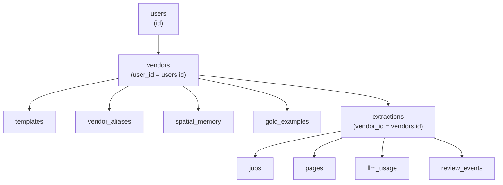
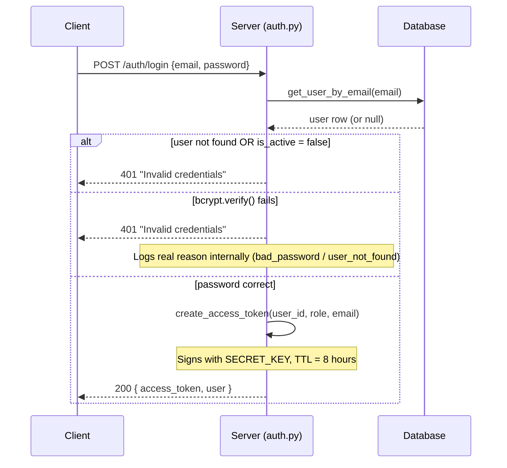
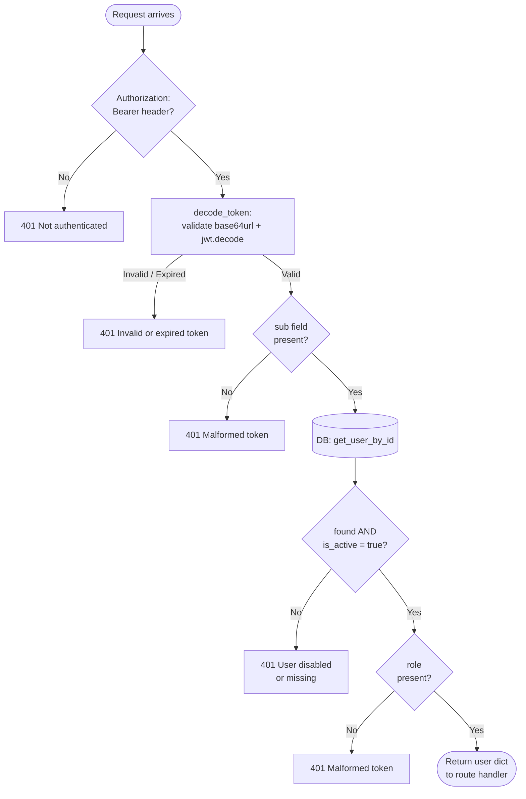
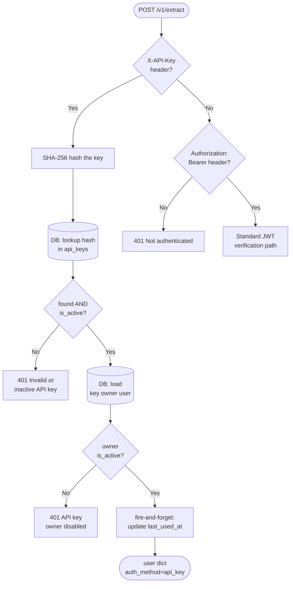
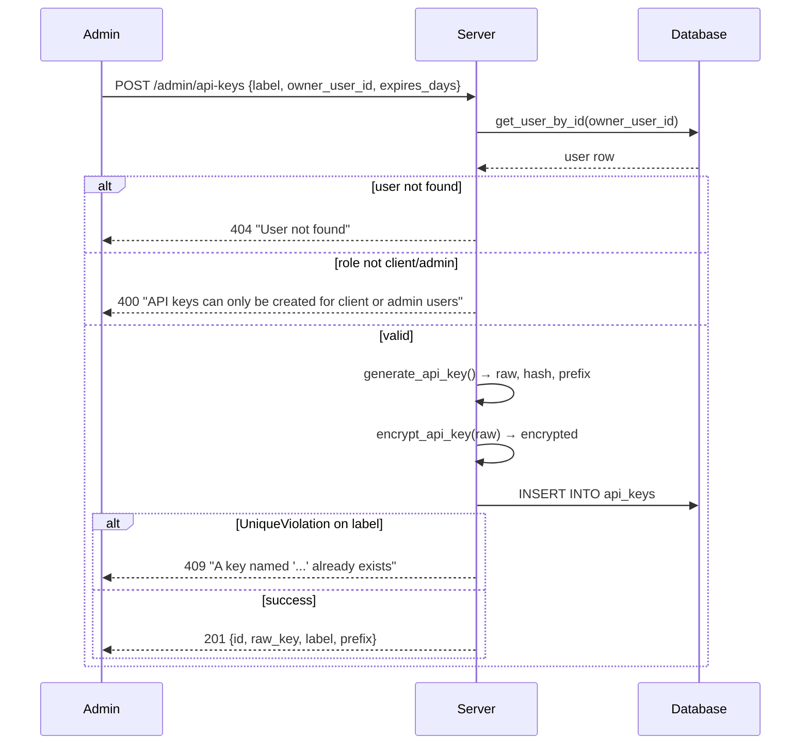
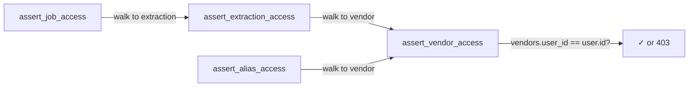
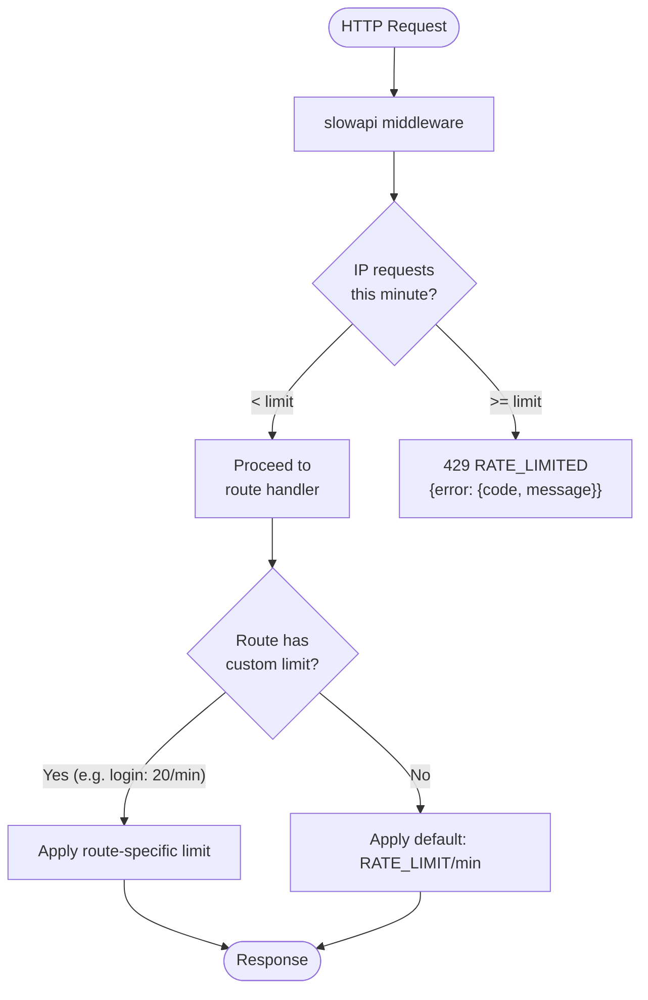
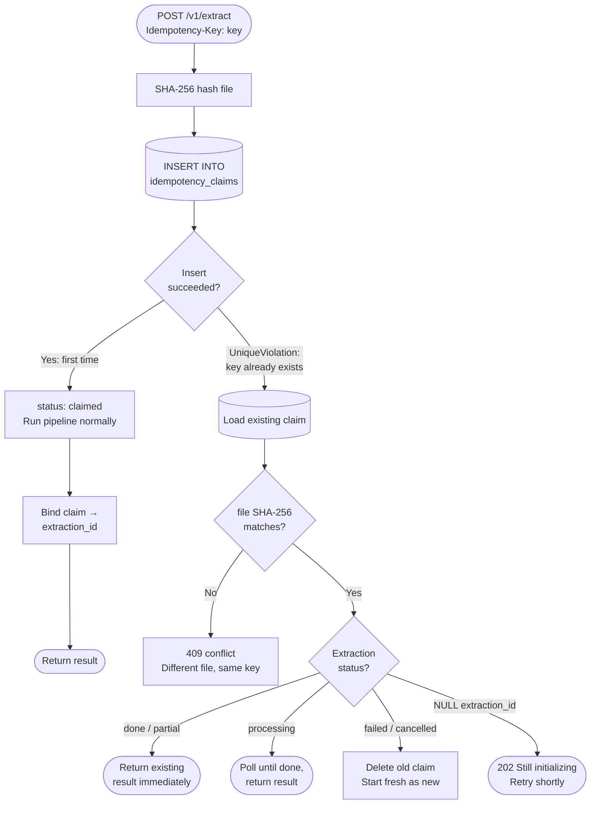

# Auth, Access, and Isolation

This document covers how users log in, how every API request is verified, how API keys work, how admin manages API keys, how multi-tenancy isolates each client's data, how rate limiting protects the server, and how idempotency prevents duplicate extractions when the same file is submitted twice.

---

## What it is

The auth system controls who can do what and who can see what. It has six jobs:

1. **Login** — verify email + password, return a JWT token the client uses for all future requests.
2. **Request verification** — on every protected route, decode the JWT (or API key) and identify who is calling.
3. **Multi-tenancy** — every piece of data chains back to a `user_id` through the `vendors` table. The system refuses to serve Client A's data to Client B, even if they somehow know the ID. No `user_id` column on extractions or jobs — ownership always resolves by walking back to the vendor.
4. **API Keys** — admin-managed per-user keys for programmatic access. Used by the `/v1/extract` endpoint for ERP integrations and headless clients.
5. **Rate limiting** — slowapi middleware on every route. Prevents abuse and brute-force attempts.
6. **Idempotency** — when the same file is submitted twice with the same key, return the original result instead of running the pipeline again.

---

## Key Concepts

### JWT (JSON Web Token)

A JWT is a self-contained token the server creates at login. It contains three parts separated by dots: `header.payload.signature`.

```
eyJhbGciOiJIUzI1NiJ9  .  eyJzdWIiOiJ1c2VyLTEiLCJyb2xlIjoiY2xpZW50IiwiZXhwIjoxNzAwMDAwMH0  .  SflKxwRJSMeKKF2QT4fwpMeJf36POk6yJV_adQssw5c
|_____________________| |____________________________________________________________________|  |_______________________________________________|
       HEADER                                    PAYLOAD                                                        SIGNATURE
  algorithm: HS256              sub (user id), role, email, iat, exp                         HMAC-SHA256(header + payload, SECRET_KEY)
  type: JWT
```

- The **header** says which algorithm was used (HS256 — a symmetric HMAC algorithm).
- The **payload** carries `sub` (user ID), `role`, `email`, `iat` (issued at), `exp` (expires at).
- The **signature** is a cryptographic hash of header + payload using `SECRET_KEY`. Nobody can forge a valid signature without knowing the secret key.

The client stores the token and sends it in every request as: `Authorization: Bearer <token>`.

The token expires after **8 hours**. There is no refresh token. The client logs in again each morning.

The server never stores tokens — it only stores the `SECRET_KEY` needed to verify them. This means tokens cannot be "revoked" mid-session. If a user is deactivated, the server checks the database on every request and rejects the call even if the token is technically still valid.

### bcrypt

Passwords are never stored in plain text. When a user is created, the password is hashed with bcrypt (a slow, salted algorithm). At login, bcrypt re-hashes the attempt and compares. The hash is a one-way function — even if the database is leaked, passwords cannot be recovered.

bcrypt only processes the first 72 bytes of a password. Longer passwords are silently truncated to 72 bytes before hashing to avoid surprising behaviour.

### Roles

There are two roles: `admin` and `client`.

- `admin` bypasses every ownership check. Admin can read and modify any user's data.
- `client` must own the resource they are accessing. Access denied otherwise.

### API Keys

API keys are an alternative to JWT tokens for programmatic access (used by the `/v1/extract` endpoint). They are sent in the `X-API-Key` header instead of `Authorization: Bearer`.

- Generated with prefix `po_live_` + 32 random bytes (URL-safe base64).
- Only the SHA-256 hash of the key is stored in the database. The raw key is shown once at creation and never again.
- The first 16 characters + `...` are stored as a prefix for display in the admin UI.
- When a request arrives with `X-API-Key`, the server hashes the incoming key and looks up the hash. If it matches an active key, the request is treated as if the key's owner sent a JWT.
- `last_used_at` is updated asynchronously (fire-and-forget) so the main request is not slowed down.

### Ownership Chain

No ownership column exists on extractions or jobs. Ownership is always resolved by walking back to the vendor:



The four ownership assertions are:

- `assert_vendor_access(pool, vendor_id, user)` — checks `vendors.user_id == user.id`
- `assert_extraction_access(pool, extraction_id, user)` — walks to vendor, calls assert_vendor_access. Also checks `billing_user_id` in document metadata for admin-on-behalf-of-client uploads.
- `assert_job_access(pool, job_id, user)` — walks to extraction, calls assert_extraction_access.
- `assert_alias_access(pool, alias_id, user)` — walks to vendor, calls assert_vendor_access.

Admin role short-circuits every assert — the first line in each function is `if _is_admin(user): return`.

---

## How Login Works — Step by Step

1. Client sends `POST /auth/login` with `{"email": "...", "password": "..."}`.
2. Server looks up the user by email in the database.
3. If the user does not exist or `is_active` is false → HTTP 401 `"Invalid credentials"`. The reason (not found vs wrong password) is deliberately not revealed to the caller to prevent user enumeration.
4. The same generic `"Invalid credentials"` message is returned for a wrong password. The security logger logs the real reason internally (`user_not_found` or `bad_password`).
5. If the password matches → server calls `create_access_token(user_id, role, email)`.
6. The token is signed with `SECRET_KEY` using HS256.
7. Server returns `{"access_token": "...", "user": {...}}`.
8. The client stores the token. All subsequent requests send it as `Authorization: Bearer <token>`.

The login endpoint has a **separate rate limit of 20 requests per minute** (stricter than the default 30/min for other routes) to slow down brute-force attempts.



---

## How Every Request is Verified — Step by Step

1. FastAPI's `get_current_user` dependency runs on every protected route.
2. It extracts the token from the `Authorization: Bearer` header.
3. If no token → HTTP 401 `"Not authenticated"`.
4. It calls `decode_token(token)`:
   - First validates the token is canonical base64url format (rejects malformed tokens early).
   - Then calls `jwt.decode()` using `SECRET_KEY` and HS256.
   - If expired or tampered → HTTP 401 `"Invalid or expired token"`. The actual JWT error is never sent to the client.
5. Extracts `sub` (user ID) from the payload.
6. Looks up the user by ID in the database. If not found or `is_active` is false → HTTP 401 `"User disabled or missing"`.
7. Returns `{"id": user_id, "role": role, "email": email}` to the route handler.

The database lookup on every request ensures a deactivated user is rejected immediately, even if their token has not expired yet.



---

## How API Key Verification Works

The `get_current_user_or_api_key` dependency is used on the `/v1/extract` endpoint. It checks both auth methods:

1. If `X-API-Key` header is present → hash it with SHA-256 → look up the hash in `api_keys` table.
2. If the key is not found or `is_active` is false → HTTP 401 `"Invalid or inactive API key"`.
3. Load the key owner's user record. If disabled → HTTP 401 `"API key owner disabled"`.
4. Fire-and-forget update to `last_used_at`.
5. Return user dict with `"auth_method": "api_key"` and `"api_key_id"` for billing tracking.
6. If no `X-API-Key` header → fall through to the JWT Bearer path (same as `get_current_user`).



---

## API Key Admin Management

API keys are managed exclusively by admins through the `/admin/api-keys` routes. Clients cannot create, list, or revoke their own keys. All routes require the `require_admin` dependency.

### api_keys Table Schema

```
┌─────────────────┬──────────────┬──────────────────────────────────────────┐
│ Column          │ Type         │ Notes                                    │
├─────────────────┼──────────────┼──────────────────────────────────────────┤
│ id              │ SERIAL PK    │ Auto-incrementing integer.               │
│ user_id         │ UUID NOT NULL│ FK → users(id) ON DELETE CASCADE.        │
│ label           │ TEXT NOT NULL│ Human-readable name (not enforced unique │
│                 │              │ in DDL, but route handles collisions as  │
│                 │              │ unique for UX).                          │
│ key_hash        │ VARCHAR(255) │ UNIQUE. SHA-256 of the raw key.          │
│ prefix          │ VARCHAR(32)  │ First 16 chars + "..." for display.      │
│ encrypted_key   │ TEXT         │ Fernet-encrypted raw key for admin       │
│                 │              │ reveal. Added in a later migration.      │
│ is_active       │ BOOLEAN      │ DEFAULT TRUE. Soft disable switch.       │
│ expires_at      │ TIMESTAMPTZ  │ Optional expiry. NULL = no expiry.       │
│ created_at      │ TIMESTAMPTZ  │ DEFAULT NOW().                           │
│ last_used_at    │ TIMESTAMPTZ  │ Updated fire-and-forget on each use.     │
└─────────────────┴──────────────┴──────────────────────────────────────────┘

Indexes:
  idx_api_keys_hash  ON api_keys(key_hash)    — hash lookup on every request
  idx_api_keys_user  ON api_keys(user_id)     — list keys per user
```

### Key Generation

```python
raw = "po_live_" + secrets.token_urlsafe(32)   # e.g. po_live_aBc123...
hashed = hashlib.sha256(raw.encode()).hexdigest()
prefix = raw[:16] + "..."                       # e.g. po_live_aBc123...
```

Three values are produced: `raw_key` (shown once), `key_hash` (stored for lookup), `prefix` (stored for admin UI display).

Additionally, the raw key is **Fernet-encrypted** using a key derived from `SECRET_KEY` (SHA-256 → base64url). The encrypted blob is stored in `encrypted_key` so admins can reveal the key later via the `/reveal` endpoint.

### Admin Routes

| Method   | Route                             | What it does                                    |
|----------|-----------------------------------|-------------------------------------------------|
| `POST`   | `/admin/api-keys`                 | Create a new key for a client user.             |
| `GET`    | `/admin/api-keys`                 | List all keys with owner email + usage stats.   |
| `GET`    | `/admin/api-keys/{id}/reveal`     | Decrypt and return the raw key.                 |
| `PATCH`  | `/admin/api-keys/{id}/deactivate` | Soft-disable: key stops working immediately.    |
| `PATCH`  | `/admin/api-keys/{id}/reactivate` | Re-enable a previously deactivated key.         |
| `DELETE` | `/admin/api-keys/{id}`            | Hard-delete: row removed, usage history in `llm_usage` preserved. |

### Create Key — Step by Step

1. Admin sends `POST /admin/api-keys` with `{"label": "...", "owner_user_id": "...", "expires_days": 90}`.
2. Server validates the owner user exists and has role `client` or `admin`.
3. Generates `raw_key`, `key_hash`, `prefix` using `generate_api_key()`.
4. Encrypts the raw key with Fernet → `encrypted_key`.
5. Computes `expires_at` from `expires_days` (or `NULL` if omitted).
7. If a key with the same label already exists for this user → HTTP 409 `"A key named '...' already exists"`. (Note: The codebase catches `UniqueViolationError` on insertion and attributes it to a label conflict, but in the database the only UNIQUE constraint is actually on `key_hash`.)
8. Returns `{"id": ..., "raw_key": "po_live_...", "label": "...", "prefix": "po_live_aBc1..."}`.
9. **The raw key is shown once in this response and never again** (unless the admin uses `/reveal`).



### List Keys Response Shape

`GET /admin/api-keys` returns a list. Each entry includes usage stats aggregated from `llm_usage`:

```json
{
  "id": 3,
  "user_id": "a1b2c3...",
  "label": "erp_integration",
  "prefix": "po_live_aBc123...",
  "is_active": true,
  "owner_email": "client@example.com",
  "total_input_tokens": 142500,
  "total_output_tokens": 38200,
  "total_tokens": 180700,
  "total_documents": 47,
  "total_pages": 312,
  "created_at": "2025-01-15T10:30:00Z",
  "last_used_at": "2025-05-28T14:22:00Z",
  "expires_at": "2025-07-15T10:30:00Z"
}
```

Usage stats are computed via a `LEFT JOIN` on `llm_usage` where `api_key_id = ak.id`. `total_pages` counts distinct `(extraction_id, page_num)` pairs with `call_type = 'extraction'`. `total_documents` counts distinct `doc_id` values.

### Reveal Key

`GET /admin/api-keys/{id}/reveal` decrypts the Fernet-encrypted blob stored in `encrypted_key`. If the key was created before encrypted storage was added (migration gap), the endpoint returns HTTP 404 with `"This key was created before encrypted storage was added. Deactivate it and create a new one."`.

### Deactivate vs Delete

- **Deactivate** (`PATCH .../deactivate`): Sets `is_active = FALSE`. The key immediately stops authenticating. The row and all usage history remain. Reversible via `/reactivate`.
- **Delete** (`DELETE /admin/api-keys/{id}`): Hard-deletes the row from `api_keys`. Usage rows in `llm_usage` that reference this `api_key_id` are **preserved** (the FK is nullable/absent, so no cascade). Irreversible.

### Key Expiry

If `expires_days` is set at creation, the server computes `expires_at = now() + expires_days`. During verification (`verify_api_key_hash`), the SQL filter includes `AND (expires_at IS NULL OR expires_at > NOW())` — expired keys are silently rejected as if they don't exist.

---

## Multi-Tenancy

### Design Principle

The system serves ~5 external clients. Each client sees only their own vendors, templates, extractions, and jobs. There is **no shared namespace** — everything is isolated.

### How Isolation is Enforced

Every table chains back to `users` through the `vendors` table:

```
users
  └── vendors (user_id = users.id)             ← ownership anchor
        ├── templates
        ├── vendor_aliases
        ├── spatial_memory
        ├── gold_examples
        ├── qwen_layout_boxes
        ├── documents → extractions             ← no user_id column
        │     ├── jobs                          ← no user_id column
        │     ├── pages                         ← no user_id column
        │     ├── llm_usage                     ← user_id present for historical billing
        │     └── review_events                 ← no user_id column
        └── field_mappings
```

**Critical design choice**: extractions, jobs, and pages have **no `user_id` column**. Ownership is always resolved by walking back to the vendor's `user_id`. (Note: `llm_usage` has a `user_id` column added via migration to preserve historical token billing data when a vendor or extraction is deleted, but access control still resolves through the vendor ownership chain). This means:

- There is only **one place** to check ownership: the vendor.
- No possibility of inconsistency between a `user_id` on an extraction and the vendor's owner.
- Changing a vendor's owner (if ever needed) automatically moves all downstream data.

### The Four Ownership Assertions

Every route that reads or modifies a resource calls one of these before returning data:



Each assertion function follows the same pattern:

```python
async def assert_vendor_access(pool, vendor_id, user):
    if _is_admin(user): return           # admin bypasses everything
    owner = await db.get_vendor_owner(pool, vendor_id)
    if owner is None:
        raise HTTPException(404, "Vendor not found")
    if owner != user["id"]:
        raise HTTPException(403, "Access denied")
```

The admin short-circuit is always the first line. This keeps the ownership logic clean — admin never touches the ownership path.

### Billing User ID Override

When an admin uploads a document on behalf of a client (e.g. via the folder watcher), the document's metadata includes `billing_user_id`. In `assert_extraction_access`, if `billing_user_id` is present in the document metadata, the assertion checks against that instead of the vendor owner. This allows the client to see extractions that were uploaded by admin on their behalf.

### Vendor Name Uniqueness

Vendor names are unique per owner (case-insensitive), enforced by a partial unique index:

```sql
CREATE UNIQUE INDEX vendors_owner_name_uniq
    ON vendors (user_id, lower(name))
    WHERE user_id IS NOT NULL;
```

Client A and Client B can both have a vendor named "Acme Corp" — they are completely separate rows with separate templates, aliases, and extractions.

### What Admin Sees

Admin (`role = "admin"`) bypasses every ownership check. Admin can:

- List all users and their subscriptions.
- View any vendor, template, extraction, or job.
- Upload documents on behalf of any client.
- Create API keys for any client.
- Access admin-only routes (`/admin/*`).

Client routes (e.g. `GET /extractions`) automatically filter to only the calling user's vendors via SQL: `WHERE v.user_id = $1`.

---

## Rate Limiting

### What it is

Every API route is rate-limited using [slowapi](https://github.com/laurentS/slowapi), a FastAPI-compatible wrapper around the `limits` library. Rate limiting prevents abuse, brute-force attacks, and accidental runaway clients.

### Configuration

| Env Variable            | Default  | Description                                           |
|-------------------------|----------|-------------------------------------------------------|
| `RATE_LIMIT_PER_MINUTE` | `30`     | Max requests per minute per IP for standard routes.   |

The value is read from `config.py` and passed to the limiter at startup:

```python
from slowapi import Limiter
from slowapi.util import get_remote_address

limiter = Limiter(key_func=get_remote_address, default_limits=[f"{RATE_LIMIT}/minute"])
```

### How it works — Step by Step

1. Every request hits the `slowapi` middleware before reaching the route handler.
2. The middleware identifies the caller by IP address (`get_remote_address`).
3. If the IP has exceeded the configured limit within the current 1-minute window → the request is rejected.
4. The rejection handler returns HTTP 429 with a standardized error envelope.
5. If the limit is not exceeded → the request proceeds normally.

### Per-Route Overrides

Most routes use the default limit (`RATE_LIMIT_PER_MINUTE`, typically 30/min). The login endpoint is an exception:

| Route            | Limit      | Why                                          |
|------------------|------------|----------------------------------------------|
| `POST /auth/login` | **20/min** | Stricter limit to slow down brute-force attacks. |
| All other routes | 30/min     | Default from `RATE_LIMIT_PER_MINUTE`.        |

Each route explicitly applies the limiter decorator:

```python
@app.post("/auth/login")
@limiter.limit("20/minute")         # stricter for login
async def login(request: Request, body: LoginRequest):
    ...

@app.get("/health")
@limiter.limit(f"{RATE_LIMIT}/minute")   # default
async def health(request: Request):
    ...
```

### Error Response

When rate limited, the server returns:

```json
{
  "error": {
    "code": "RATE_LIMITED",
    "message": "Rate limit exceeded: 30 per 1 minute"
  }
}
```

HTTP status code: **429 Too Many Requests**.

### Rate Limit Architecture



### Key Details

- **Keying**: By remote IP address. All users behind the same IP share the same counter. In production behind a reverse proxy, ensure `X-Forwarded-For` is set correctly.
- **Window**: Rolling 1-minute window. The counter resets after 60 seconds of no requests.
- **Scope**: Applied to every route in the application. No route is exempt.
- **Health check suppression**: The `/health`, `/api/client/heartbeat`, `/api/config`, and `/api/scheduler` routes still count against the rate limit but their access log lines are suppressed at the INFO level to reduce log noise. Errors (4xx/5xx) still log.

---

## How Idempotency Works

Idempotency is only used on the `/v1/extract` endpoint (the API key path). It prevents the same file from being processed twice if the client retries after a network error.

### The Idempotency-Key header

The client sends a unique string in the `Idempotency-Key` header when uploading. This string is the client's responsibility — typically a UUID they generate per file submission. The server uses it to detect duplicate submissions.

### What the server does — step by step

1. Client sends `POST /v1/extract` with `Idempotency-Key: <key>`.
2. Server hashes the file (SHA-256) and attempts to insert a row into `idempotency_claims(user_id, idempotency_key, file_sha256)`.
3. The table has a `UNIQUE(user_id, idempotency_key)` constraint, so duplicate keys are caught at the database level.

### The three outcomes when claiming

| Outcome | What happened | What server does |
|---|---|---|
| `claimed` | First time this key is seen | Proceed with the extraction. Bind the new extraction_id to the claim row once created. |
| `duplicate` | Same key, same file SHA-256 | Return the existing result (if done) or wait for it to finish. Do NOT start a new extraction. |
| `conflict` | Same key, different file SHA-256 | HTTP 409. The client is reusing a key with a different file — this is a programming error. |

### What "duplicate" does in detail

- If the existing extraction is `done`, `complete`, or `partial` → return the existing result immediately. No pipeline run.
- If it is still `processing` → poll and wait for it to finish, then return the result.
- If it is `failed` or `cancelled` → delete the old claim and start fresh as if it were a new submission.
- If the extraction_id is NULL (the claim exists but the extraction has not been created yet) → return HTTP 202, telling the client to retry in a moment.



### Claim lifecycle

- A claim is inserted before the extraction is created.
- Once the extraction is created, `bind_idempotency_claim` updates the claim row with `extraction_id` and `document_id`.
- If anything fails before the job is submitted, the claim is deleted so the next retry starts clean.
- Claims older than **24 hours** are deleted by `recover_stale_jobs()` which runs on every worker startup and every 60 seconds.

---

## All Scenarios

### Scenario 1 — Normal login

- User sends `POST /auth/login` with correct email and password.
- Server verifies bcrypt hash, creates JWT token (8h TTL), returns it.
- Client stores the token and uses it on every subsequent request.

### Scenario 2 — Wrong password

- User sends wrong password.
- Server logs `bad_password` internally.
- Returns HTTP 401 `"Invalid credentials"` — same message as wrong email, so the attacker cannot tell which field was wrong.

### Scenario 3 — Deactivated user tries to log in

- Admin has set `is_active = false` for the user.
- Server finds the user but `is_active` is false.
- Returns HTTP 401 `"Invalid credentials"` — same message, no information leakage.

### Scenario 4 — Deactivated user with a still-valid token

- User logged in yesterday. Admin deactivates their account today.
- User's token still has hours left before expiry.
- User sends a request with the old token.
- Server decodes the token successfully (cryptographically valid).
- Server does the database lookup and finds `is_active = false`.
- Returns HTTP 401 `"User disabled or missing"`.
- The token TTL does not matter — the live DB check always wins.

### Scenario 5 — Expired token

- Token was issued 9 hours ago (TTL is 8 hours).
- Server calls `jwt.decode()` and the library detects the `exp` field has passed.
- Returns HTTP 401 `"Invalid or expired token"`.
- The actual JWT error is never sent to the client.

### Scenario 6 — Tampered token

- Attacker modifies the payload (e.g. changes `role` to `admin`) and sends it.
- The signature no longer matches the new payload.
- `jwt.decode()` throws a `JWTError`.
- Returns HTTP 401 `"Invalid or expired token"`.

### Scenario 7 — Client A tries to access Client B's extraction

- Client A sends `GET /extractions/99` where extraction 99 belongs to Client B.
- `assert_extraction_access` walks back to the extraction's vendor.
- The vendor's `user_id` is Client B, not Client A.
- Returns HTTP 403 `"Access denied"`.
- Admin role would bypass this and return the data.

### Scenario 8 — API key request

- Client sends `POST /v1/extract` with `X-API-Key: po_live_abc...`.
- Server hashes the key (SHA-256) and finds the matching row in `api_keys`.
- Key is active, owner account is active.
- Request proceeds as if the key owner sent a JWT.
- `last_used_at` updated fire-and-forget.

### Scenario 9 — Idempotent re-submission, extraction already done

- Client sent a file yesterday with `Idempotency-Key: job-001`. It succeeded.
- Client's network glitched and they did not receive the response.
- Client retries today with the same `Idempotency-Key: job-001` and same file.
- Server finds the existing claim. File SHA-256 matches.
- Extraction status is `done`.
- Server returns the existing result. No new pipeline run.

### Scenario 10 — Idempotent re-submission, extraction still running

- Client submitted a file with `Idempotency-Key: job-002`. It is still processing (large PDF).
- Client retries with the same key.
- Server finds the claim. Extraction status is `processing`.
- Server polls and waits for the pipeline to finish, then returns the result.

### Scenario 11 — Idempotency key reused with a different file

- Client sends file A with `Idempotency-Key: key-X`.
- Client accidentally sends file B with the same `Idempotency-Key: key-X`.
- Server computes SHA-256 of file B — it does not match the stored SHA-256 for `key-X`.
- Returns HTTP 409 `"conflict"`. Nothing is processed.

### Scenario 12 — Previous extraction failed, same key retried

- Client submitted with `Idempotency-Key: job-003`. It failed.
- Client retries with the same key.
- Server finds the claim. Extraction status is `failed`.
- Server deletes the old claim and inserts a new one.
- New extraction starts fresh.

### Scenario 13 — Admin creates an API key

- Admin sends `POST /admin/api-keys` with `{"label": "erp_prod", "owner_user_id": "uuid-of-client"}`.
- Server validates the owner exists and is a client.
- Generates key, inserts row, returns `{"raw_key": "po_live_..."}`.
- Admin copies the raw key and sends it to the client via a secure channel.

### Scenario 14 — Admin deactivates an API key

- Admin sends `PATCH /admin/api-keys/3/deactivate`.
- Server sets `is_active = FALSE` on key ID 3.
- All subsequent requests with that key immediately fail with HTTP 401.
- Key can be reactivated later.

### Scenario 15 — Expired API key used

- An API key was created with `expires_days: 30` on January 1.
- Client uses the key on February 15 (45 days later).
- `verify_api_key_hash` SQL includes `AND (expires_at IS NULL OR expires_at > NOW())`.
- The expired key is not found → HTTP 401 `"Invalid or inactive API key"`.

### Scenario 16 — Rate limit exceeded

- A script sends 35 requests in one minute from the same IP.
- The first 30 succeed (assuming default `RATE_LIMIT_PER_MINUTE=30`).
- Requests 31–35 receive HTTP 429 `"Rate limit exceeded: 30 per 1 minute"`.
- After 60 seconds, the counter resets and new requests succeed again.

### Scenario 17 — Login brute-force throttled

- An attacker sends 25 login attempts per minute.
- The first 20 are processed (all fail with 401).
- Attempts 21–25 are rejected with HTTP 429 before even checking the password.
- The stricter 20/min limit on `/auth/login` protects against credential stuffing.

### Scenario 18 — Client A and Client B both have a vendor named "Acme"

- Client A creates a vendor named "Acme Corp". Gets vendor ID `42`.
- Client B creates a vendor named "Acme Corp". Gets vendor ID `43`.
- Both vendors are completely separate. Different templates, aliases, extractions.
- The `vendors_owner_name_uniq` partial unique index allows this because `user_id` is different.
- Client A querying vendors only sees vendor `42`. Client B only sees `43`.

---

## Error Responses

| Situation | HTTP | Message |
|---|---|---|
| Wrong email or password | 401 | `"Invalid credentials"` |
| Inactive user at login | 401 | `"Invalid credentials"` |
| No Authorization header | 401 | `"Not authenticated"` |
| Expired or tampered token | 401 | `"Invalid or expired token"` |
| User deactivated after login | 401 | `"User disabled or missing"` |
| Token missing `sub` field | 401 | `"Malformed token"` |
| Token missing `role` field | 401 | `"Malformed token"` |
| Non-admin accessing admin route | 403 | `"Admin only"` |
| Client accessing another client's data | 403 | `"Access denied"` |
| Vendor/alias/extraction not found | 404 | `"Vendor not found"` / `"Extraction not found"` / etc. |
| Invalid or inactive API key | 401 | `"Invalid or inactive API key"` |
| API key owner deactivated | 401 | `"API key owner disabled"` |
| API key not found (admin reveal) | 404 | `"API key not found"` |
| Duplicate API key label for same user | 409 | `"A key named '...' already exists for this user"` |
| API key for invalid role | 400 | `"API keys can only be created for client or admin users"` |
| Pre-migration key reveal attempt | 404 | `"This key was created before encrypted storage was added"` |
| Idempotency key used with different file | 409 | `"conflict"` |
| `SECRET_KEY` not configured on server | 500 | `"SECRET_KEY is not configured on the server"` |
| Rate limit exceeded | 429 | `"Rate limit exceeded: {limit} per 1 minute"` |

---

## Quick Reference

| Question | Answer |
|---|---|
| Where is the token stored on the server? | It is not. The server only stores `SECRET_KEY`. |
| How long does a token last? | 8 hours. No refresh. Log in again. |
| Can a deactivated user's token still work? | No. Every request checks `is_active` in the DB. |
| Why does wrong password give the same error as wrong email? | To prevent user enumeration — an attacker should not be able to tell if an email exists. |
| How is the password protected in the database? | bcrypt hash. One-way. Salted. 72-byte limit enforced explicitly. |
| How are API keys stored? | SHA-256 hash only. Raw key shown once. Fernet-encrypted copy for admin reveal. |
| Which routes use API key auth? | `/v1/extract` only. All other routes use JWT. |
| Who can create API keys? | Admin only. Via `POST /admin/api-keys`. |
| Can a client create their own API key? | No. All key management is admin-only. |
| Can an admin see the raw key after creation? | Yes. `GET /admin/api-keys/{id}/reveal` decrypts the Fernet blob. |
| What happens when an API key expires? | It silently stops authenticating. SQL filter excludes expired keys. |
| Can a deactivated key be reactivated? | Yes. `PATCH /admin/api-keys/{id}/reactivate`. |
| Does deleting a key delete usage history? | No. `llm_usage` rows referencing the key are preserved. |
| How does multi-tenancy work? | All data chains through vendors.user_id. No user_id on extractions/jobs/pages (llm_usage has user_id only to preserve billing data). |
| Can Client A see Client B's vendors? | No. Every query filters by the calling user's vendor ownership. |
| Can two clients have the same vendor name? | Yes. Name uniqueness is per-owner (partial unique index). |
| What is the default rate limit? | 30 requests per minute per IP. Configurable via `RATE_LIMIT_PER_MINUTE`. |
| What is the login rate limit? | 20 requests per minute. Hardcoded, not configurable. |
| What happens when rate limited? | HTTP 429 with `{"error": {"code": "RATE_LIMITED", ...}}`. |
| Is rate limiting per user or per IP? | Per IP address. All users behind the same IP share the counter. |
| What is the idempotency key? | A string the client generates per submission, sent in `Idempotency-Key` header. |
| Where is idempotency used? | Only on `/v1/extract`. The UI upload route does not use it. |
| How long do idempotency claims last? | 24 hours. Auto-purged by the worker recovery loop. |
| What happens if the same key is used with a different file? | HTTP 409. Nothing is processed. |
