# Database Schema & Query Layer

> Source file: [backend/db.py](../../backend/db.py)

This document provides a comprehensive overview of the database design, schema, custom migrations, query patterns, and data lifecycles for the application.

---

## What it is

The application uses **PostgreSQL** as its primary persistent store. The database layer is designed with **no Object-Relational Mapper (ORM)**. Instead, all SQL queries are written as raw, optimized SQL queries using the asynchronous `asyncpg` driver. 

Key benefits of this approach:
- Complete control over query optimization, indexing, and transaction boundaries.
- No ORM abstraction overhead, which is crucial for handling heavy `JSONB` columns (like OCR coordinates and page images) without memory inflation.
- Explicit definition of data transformations and data types.

---

## Key States & Architecture

### Connection Pool Configuration
The application initializes a connection pool using `asyncpg.create_pool` with the following configuration settings:
- **`min_size`**: `2` connections (ensures low-latency start for requests).
- **`max_size`**: `10` connections (limits concurrency to prevent saturating the PostgreSQL engine).
- **`command_timeout`**: `30` seconds (prevents deadlocks or runaway queries from blocking connection pool resources).

```python
async def create_pool() -> asyncpg.Pool:
    return await asyncpg.create_pool(
        DATABASE_URL,
        min_size=2,
        max_size=10,
        command_timeout=30,
    )
```

### Idempotent Schema Bootstrapping
There is no external migration framework (like Alembic). All tables and migrations are declared inside the `_SCHEMA_SQL` DDL string and run inside the `init()` method at startup:
1. **Advisory Locking**: The server acquires a PostgreSQL advisory lock (`augocr_db_init`) to serialize schema validation during concurrent worker boots (e.g., when scaling up Docker containers).
2. **Idempotence**: Every alteration/addition uses idempotent clauses like `IF NOT EXISTS` or checks against the `information_schema` tables.
3. **Deadlock Recovery**: A retry loop attempts schema initialization up to 8 times with a randomized jitter sleep (`1.5s` to `4.0s`) if lock conflicts or deadlocks are encountered.

### Serialization & Parsing (Normalizer Helpers)
Because `asyncpg` sometimes returns `JSONB` columns as raw JSON strings rather than Python `dict` objects, `db.py` implements custom serialization normalizers:
- **`_parse_jsonb(d, *keys)`**: Mutates a dictionary `d` in-place, deserializing the listed `keys` from strings to dictionaries/lists using `json.loads` if needed.
- **`_record(row, *json_keys)`**: Converts an `asyncpg.Record` row to a standard mutable Python `dict` and applies `_parse_jsonb` to deserialize nested JSON properties. Returns `None` if the row is empty.
- **`_stringify_uuid_fields(row, *keys)`**: Casts UUID objects returned by the database into standard strings to ensure serializability in API responses.

---

## Entity-Relationship (ER) Diagram

The following Mermaid diagram shows the relations between the core tables of the database:

```mermaid
erDiagram
    users {
        UUID id PK
        TEXT email UK
        TEXT hashed_pw
        TEXT role
        BOOLEAN is_active
        TIMESTAMPTZ created_at
        INT subscription_limit
        INT pending_pages
    }
    vendors {
        TEXT id PK
        TEXT name
        TEXT status
        TIMESTAMPTZ created_at
        UUID user_id FK
        INT client_seq
    }
    templates {
        INT id PK
        TEXT vendor_id FK, UK
        TEXT format_type
        JSONB header_fields
        JSONB line_item_fields
        TEXT prompt_instructions
        JSONB extraction_rules
        TEXT system_prompt
        TEXT prompt_hash
        TIMESTAMPTZ created_at
        TIMESTAMPTZ updated_at
    }
    documents {
        INT id PK
        TEXT vendor_id FK
        TEXT source_type
        TEXT source_ref
        TEXT filename
        TEXT mime_type
        BIGINT size_bytes
        TEXT object_key
        JSONB metadata
        TEXT status
        TIMESTAMPTZ created_at
        TIMESTAMPTZ updated_at
    }
    extractions {
        INT id PK
        INT document_id FK
        TEXT vendor_id FK
        INT template_id FK
        TEXT filename
        INT total_pages
        TEXT format_type
        JSONB header_fields
        JSONB line_item_fields
        JSONB result
        JSONB page_results
        JSONB field_locations
        JSONB ocr_data
        JSONB corrected_result
        JSONB correction_meta
        TEXT export_object_key
        JSONB progress
        BOOLEAN cancel_requested
        TEXT status
        TEXT error
        INT duration_ms
        TIMESTAMPTZ created_at
        TIMESTAMPTZ updated_at
        JSONB mapped_result
    }
    pages {
        INT id PK
        INT extraction_id FK
        INT page_number
        TEXT image_b64
        TEXT object_key
        TEXT mime_type
        INT width
        INT height
        INT orig_width
        INT orig_height
        TEXT source
        INT char_count
        JSONB word_geometry
    }
    gold_examples {
        INT id PK
        TEXT vendor_id FK
        INT extraction_id FK
        JSONB original_result
        JSONB corrected_result
        JSONB correction_diff
        TIMESTAMPTZ created_at
    }
    jobs {
        INT id PK
        INT extraction_id FK
        INT document_id FK
        TEXT job_type
        TEXT status
        JSONB payload
        JSONB progress
        INT attempts
        INT max_attempts
        INT priority
        TEXT locked_by
        TIMESTAMPTZ locked_at
        TIMESTAMPTZ started_at
        TIMESTAMPTZ finished_at
        TEXT error
        TIMESTAMPTZ created_at
        TIMESTAMPTZ updated_at
    }
    review_events {
        INT id PK
        INT extraction_id FK
        TEXT actor
        TEXT reason_code
        TEXT note
        JSONB before_result
        JSONB after_result
        JSONB before_locations
        JSONB after_locations
        JSONB diff
        TIMESTAMPTZ created_at
    }
    llm_usage {
        INT id PK
        TIMESTAMPTZ ts
        TEXT request_id
        TEXT doc_id
        INT extraction_id FK
        TEXT vendor_id FK
        UUID user_id
        INT page_num
        INT total_pages
        TEXT call_type
        TEXT model
        INT prompt_tokens
        INT completion_tokens
        INT total_tokens
        REAL duration_ms
        TEXT llm_url
        INT api_key_id
    }
    field_mappings {
        INT id PK
        TEXT vendor_id FK, UK
        INT template_id FK
        INT schema_id FK
        JSONB header_map
        JSONB line_map
        JSONB header_snapshot
        JSONB line_snapshot
        JSONB pending_notices
        TIMESTAMPTZ created_at
        TIMESTAMPTZ updated_at
    }
    output_schemas {
        INT id PK
        TEXT name UK
        TEXT slug UK
        BOOLEAN is_system
        TEXT_ARRAY header_fields
        TEXT_ARRAY line_fields
        TEXT_ARRAY header_fields_snapshot
        TEXT_ARRAY line_fields_snapshot
        TIMESTAMPTZ created_at
        TIMESTAMPTZ updated_at
    }
    vendor_aliases {
        INT id PK
        TEXT vendor_id FK
        TEXT pattern
        INT weight
        TEXT source
        TIMESTAMPTZ created_at
    }
    spatial_memory {
        INT id PK
        TEXT vendor_id FK
        TEXT layout_key
        TEXT field_key
        INT page_number
        JSONB normalized_box
        TEXT source_engine
        INT created_from_extraction_id FK
        TIMESTAMPTZ last_verified_at
        BOOLEAN is_active
    }
    qwen_layout_boxes {
        INT id PK
        TEXT vendor_id FK
        INT template_id FK
        TEXT field_key
        TEXT field_type
        JSONB normalized_box
        INT page_number
        INT created_from_extraction_id FK
        TIMESTAMPTZ created_at
        TIMESTAMPTZ updated_at
    }
    api_keys {
        INT id PK
        UUID user_id FK
        TEXT label
        VARCHAR key_hash UK
        VARCHAR prefix
        BOOLEAN is_active
        TEXT encrypted_key
        TIMESTAMPTZ expires_at
        TIMESTAMPTZ created_at
        TIMESTAMPTZ last_used_at
    }
    idempotency_claims {
        INT id PK
        UUID user_id FK
        TEXT idempotency_key
        TEXT file_sha256
        INT extraction_id FK
        INT document_id FK
        TIMESTAMPTZ created_at
    }
    subscriptions {
        INT id PK
        UUID user_id FK
        INT page_limit
        TIMESTAMPTZ period_start
        TIMESTAMPTZ period_end
        TEXT status
        TEXT note
        UUID created_by FK
        TIMESTAMPTZ created_at
    }
    topups {
        INT id PK
        UUID user_id FK
        INT subscription_id FK
        INT pages
        TEXT note
        UUID created_by FK
        TIMESTAMPTZ created_at
    }
    topup_requests {
        INT id PK
        UUID user_id FK
        INT requested_pages
        TEXT requested_period
        TEXT note
        TEXT status
        TEXT resolution_note
        UUID resolved_by FK
        TIMESTAMPTZ resolved_at
        TIMESTAMPTZ created_at
    }

    users ||--o{ vendors : "owns"
    users ||--o{ api_keys : "authenticates"
    users ||--o{ subscriptions : "possesses"
    users ||--o{ topups : "purchases"
    users ||--o{ topup_requests : "submits"
    users ||--o{ idempotency_claims : "claims"
    
    vendors ||--|| templates : "configures"
    vendors ||--o{ documents : "processes"
    vendors ||--o{ extractions : "contains"
    vendors ||--o{ vendor_aliases : "matches"
    vendors ||--o{ spatial_memory : "remembers"
    vendors ||--o{ qwen_layout_boxes : "predicts"
    vendors ||--o{ gold_examples : "consolidates"
    vendors ||--|| field_mappings : "remaps"
    
    templates ||--o{ extractions : "structures"
    templates ||--o{ field_mappings : "binds"
    templates ||--o{ qwen_layout_boxes : "positions"
    
    documents ||--o{ extractions : "triggers"
    documents ||--o{ jobs : "enqueues"
    documents ||--o{ idempotency_claims : "deduplicates"
    
    extractions ||--o{ pages : "segments"
    extractions ||--o{ jobs : "tracks"
    extractions ||--o{ review_events : "audits"
    extractions ||--o{ llm_usage : "records"
    extractions ||--o{ gold_examples : "teaches"
    extractions ||--o{ idempotency_claims : "references"
    
    output_schemas ||--o{ field_mappings : "specifies"
    subscriptions ||--o{ topups : "augments"
```



---

## Table Schemas & Constraints

The database is built on 20 tables. Below is the purpose, definition, and architectural detail for each table.

### 1. `users` — Tenant Accounts
Stores tenant account records. User limits and pending quotas are managed in this table.
```sql
CREATE TABLE IF NOT EXISTS users (
    id                 UUID PRIMARY KEY DEFAULT gen_random_uuid(),
    email              TEXT UNIQUE NOT NULL,
    hashed_pw          TEXT NOT NULL,
    role               TEXT NOT NULL DEFAULT 'client' CHECK (role IN ('admin', 'client')),
    is_active          BOOLEAN NOT NULL DEFAULT TRUE,
    subscription_limit INT NOT NULL DEFAULT 0,
    pending_pages      INT NOT NULL DEFAULT 0,
    created_at         TIMESTAMPTZ DEFAULT NOW()
);
```
- **`hashed_pw`**: Contains bcrypt `$2b$` string. Never returned by query handlers.
- **`pending_pages`**: Tracks active in-flight pages before billing, preventing concurrent upload race conditions.

### 2. `vendors` — Tenant Boundaries
Defines tenant boundaries. The system utilizes vendors to isolate data.
```sql
CREATE TABLE IF NOT EXISTS vendors (
    id         TEXT PRIMARY KEY,
    name       TEXT NOT NULL,
    status     TEXT DEFAULT 'idle',
    user_id    UUID REFERENCES users(id) ON DELETE SET NULL,
    client_seq INT,
    created_at TIMESTAMPTZ DEFAULT NOW()
);
CREATE INDEX IF NOT EXISTS vendors_user_id_idx ON vendors (user_id);
CREATE UNIQUE INDEX IF NOT EXISTS vendors_owner_name_uniq ON vendors (user_id, lower(name)) WHERE user_id IS NOT NULL;
```
- **`id` (TEXT)**: Human-readable tenant boundary (e.g. `ACME001`).
- **`client_seq`**: Auto-incremented sequence relative to each owner, used to display "Vendor #1", "Vendor #2" dynamically.
- **`vendors_owner_name_uniq`**: Prevents identical vendor name configurations under the same user, case-insensitive.

### 3. `templates` — Vendor Extraction Instructions
Defines PO/Invoice extraction rules and prompts assigned to a vendor.
```sql
CREATE TABLE IF NOT EXISTS templates (
    id                  SERIAL PRIMARY KEY,
    vendor_id           TEXT REFERENCES vendors(id) ON DELETE CASCADE UNIQUE,
    format_type         TEXT NOT NULL,
    header_fields       JSONB NOT NULL DEFAULT '[]'::jsonb,
    line_item_fields    JSONB NOT NULL DEFAULT '[]'::jsonb,
    prompt_instructions TEXT,
    extraction_rules    JSONB DEFAULT '[]'::jsonb,
    system_prompt       TEXT,
    prompt_hash         TEXT,
    created_at          TIMESTAMPTZ DEFAULT NOW(),
    updated_at          TIMESTAMPTZ DEFAULT NOW()
);
```
- **`UNIQUE(vendor_id)`**: Guarantees exactly one template definition per vendor.
- **`system_prompt`**: Caches legacy pre-built instructions, but the extraction engine builds prompt rules fresh from current fields on every run.

### 4. `documents` — Raw File Uploads
Metadata records for raw file uploads.
```sql
CREATE TABLE IF NOT EXISTS documents (
    id          SERIAL PRIMARY KEY,
    vendor_id   TEXT REFERENCES vendors(id),
    source_type TEXT NOT NULL DEFAULT 'ui',
    source_ref  TEXT,
    filename    TEXT NOT NULL,
    mime_type   TEXT NOT NULL,
    size_bytes  BIGINT,
    object_key  TEXT,
    metadata    JSONB,
    status      TEXT NOT NULL DEFAULT 'queued',
    created_at  TIMESTAMPTZ DEFAULT NOW(),
    updated_at  TIMESTAMPTZ DEFAULT NOW()
);
```
- **`object_key`**: Corresponds to a file key stored in the object store.
- **`metadata.reserved_pages`**: Atomic counter that tracks outstanding reserved pages for this document.

### 5. `extractions` — Pipeline Extraction Runs
Central transactional log of extraction attempts and results.
```sql
CREATE TABLE IF NOT EXISTS extractions (
    id                  SERIAL PRIMARY KEY,
    document_id         INT REFERENCES documents(id) ON DELETE CASCADE,
    vendor_id           TEXT REFERENCES vendors(id),
    template_id         INT REFERENCES templates(id),
    filename            TEXT,
    total_pages         INT,
    format_type         TEXT,
    header_fields       JSONB,
    line_item_fields    JSONB,
    result              JSONB,
    page_results        JSONB,
    field_locations     JSONB,
    ocr_data            JSONB,
    corrected_result    JSONB,
    correction_meta     JSONB,
    export_object_key   TEXT,
    progress            JSONB,
    cancel_requested    BOOLEAN NOT NULL DEFAULT FALSE,
    status              TEXT DEFAULT 'pending',
    error               TEXT,
    duration_ms         INT,
    created_at          TIMESTAMPTZ DEFAULT NOW(),
    updated_at          TIMESTAMPTZ DEFAULT NOW(),
    mapped_result       JSONB
);
```
- **`ocr_data` / `page_results`**: Heavy payload columns. Avoid loading these inside list views.
- **`corrected_result`**: Persists manual user changes, keeping raw `result` unaltered for auditing and ML training comparisons.

### 6. `pages` — Page Artifacts
Page dimensions and geometries.
```sql
CREATE TABLE IF NOT EXISTS pages (
    id            SERIAL PRIMARY KEY,
    extraction_id INT REFERENCES extractions(id) ON DELETE CASCADE,
    page_number   INT NOT NULL,
    image_b64     TEXT, -- Legacy column (DROP NOT NULL applied)
    object_key    TEXT NOT NULL,
    mime_type     TEXT DEFAULT 'image/jpeg',
    width         INT,
    height        INT,
    orig_width    INT,
    orig_height   INT,
    source        TEXT,
    char_count    INT,
    word_geometry JSONB,
    UNIQUE (extraction_id, page_number)
);
```
- **`source`**: Flagged as `pypdfium` (digital PDF) or `paddleocr` (scanned image).
- **`word_geometry`**: Nested bounds of words on the page. Digital extractions skip the OCR stage if this geometry is populated.

### 7. `gold_examples` — Verified Few-Shot Examples
Redacted, verified user corrections fed into LLM system prompts.
```sql
CREATE TABLE IF NOT EXISTS gold_examples (
    id               SERIAL PRIMARY KEY,
    vendor_id        TEXT REFERENCES vendors(id) ON DELETE CASCADE,
    extraction_id    INT REFERENCES extractions(id) ON DELETE SET NULL,
    original_result  JSONB NOT NULL,
    corrected_result JSONB NOT NULL,
    correction_diff  JSONB,
    created_at       TIMESTAMPTZ DEFAULT NOW()
);
```
- **`correction_diff`**: Maps key-value changes applied by review operators.
- **`ON DELETE SET NULL`**: Assures that deletion of historical logs does not orphan few-shot prompt learnings.

### 8. `jobs` — Idempotent Pipeline Queue
Core workflow dispatch engine.
```sql
CREATE TABLE IF NOT EXISTS jobs (
    id            SERIAL PRIMARY KEY,
    extraction_id INT REFERENCES extractions(id) ON DELETE CASCADE,
    document_id   INT REFERENCES documents(id) ON DELETE CASCADE,
    job_type      TEXT NOT NULL,
    status        TEXT NOT NULL DEFAULT 'queued',
    payload       JSONB,
    progress      JSONB,
    attempts      INT NOT NULL DEFAULT 0,
    max_attempts  INT NOT NULL DEFAULT 3,
    priority      INT NOT NULL DEFAULT 100,
    locked_by     TEXT,
    locked_at     TIMESTAMPTZ,
    started_at    TIMESTAMPTZ,
    finished_at   TIMESTAMPTZ,
    error         TEXT,
    created_at    TIMESTAMPTZ DEFAULT NOW(),
    updated_at    TIMESTAMPTZ DEFAULT NOW()
);
CREATE UNIQUE INDEX IF NOT EXISTS jobs_active_idx 
ON jobs (extraction_id, job_type) 
WHERE status IN ('queued', 'running') AND extraction_id IS NOT NULL;
```
- **`jobs_active_idx`**: Partial index that enforces stage-level idempotency, preventing concurrent jobs for the same extraction and stage.

### 9. `review_events` — Audit Log
Human corrections audit tracking.
```sql
CREATE TABLE IF NOT EXISTS review_events (
    id               SERIAL PRIMARY KEY,
    extraction_id    INT REFERENCES extractions(id) ON DELETE CASCADE,
    actor            TEXT NOT NULL DEFAULT 'ui',
    reason_code      TEXT NOT NULL DEFAULT 'manual_review',
    note             TEXT,
    before_result    JSONB NOT NULL,
    after_result     JSONB NOT NULL,
    before_locations JSONB,
    after_locations  JSONB,
    diff             JSONB,
    created_at       TIMESTAMPTZ DEFAULT NOW()
);
```

### 10. `llm_usage` — Token Telemetry
Token accounting logs for usage auditing.
```sql
CREATE TABLE IF NOT EXISTS llm_usage (
    id                SERIAL PRIMARY KEY,
    ts                TIMESTAMPTZ NOT NULL DEFAULT NOW(),
    request_id        TEXT,
    doc_id            TEXT,
    extraction_id     INT, -- FK dropped to prevent nullification on deletes
    vendor_id         TEXT, -- FK dropped to preserve analytics
    user_id           UUID,
    page_num          INTEGER,
    total_pages       INTEGER,
    call_type         TEXT,
    model             TEXT,
    prompt_tokens     INTEGER NOT NULL DEFAULT 0,
    completion_tokens INTEGER NOT NULL DEFAULT 0,
    total_tokens      INTEGER NOT NULL DEFAULT 0,
    duration_ms       REAL,
    llm_url           TEXT,
    api_key_id        INT
);
```
- **FK Restrictions**: Foreign keys are detached for `extraction_id` and `vendor_id` on delete to preserve historical usage metrics for invoice reporting.

### 11. `field_mappings` — Remap Instructions
 Remapping maps from extraction structures into ERP schemas.
```sql
CREATE TABLE IF NOT EXISTS field_mappings (
    id              SERIAL PRIMARY KEY,
    vendor_id       TEXT REFERENCES vendors(id) ON DELETE CASCADE UNIQUE,
    template_id     INT REFERENCES templates(id) ON DELETE SET NULL,
    schema_id       INT REFERENCES output_schemas(id) ON DELETE SET NULL,
    header_map      JSONB NOT NULL DEFAULT '{}'::jsonb,
    line_map        JSONB NOT NULL DEFAULT '{}'::jsonb,
    header_snapshot JSONB NOT NULL DEFAULT '[]'::jsonb,
    line_snapshot   JSONB NOT NULL DEFAULT '[]'::jsonb,
    pending_notices JSONB NOT NULL DEFAULT '[]'::jsonb,
    created_at      TIMESTAMPTZ DEFAULT NOW(),
    updated_at      TIMESTAMPTZ DEFAULT NOW()
);
CREATE INDEX IF NOT EXISTS field_mappings_vendor_idx ON field_mappings (vendor_id);
```

### 12. `output_schemas` — Canonical Mapping Rules
System structures for ERP target fields.
```sql
CREATE TABLE IF NOT EXISTS output_schemas (
    id                     SERIAL PRIMARY KEY,
    name                   TEXT NOT NULL UNIQUE,
    slug                   TEXT NOT NULL UNIQUE,
    is_system              BOOLEAN DEFAULT FALSE,
    header_fields          TEXT[] NOT NULL DEFAULT '{}',
    line_fields            TEXT[] NOT NULL DEFAULT '{}',
    header_fields_snapshot TEXT[] NOT NULL DEFAULT '{}',
    line_fields_snapshot   TEXT[] NOT NULL DEFAULT '{}',
    created_at             TIMESTAMPTZ DEFAULT NOW(),
    updated_at             TIMESTAMPTZ DEFAULT NOW()
);
```

### 13. `vendor_aliases` — Vendor Detection Rules
RegEx/text pattern templates for vendor classification during uploads.
```sql
CREATE TABLE IF NOT EXISTS vendor_aliases (
    id         SERIAL PRIMARY KEY,
    vendor_id  TEXT REFERENCES vendors(id) ON DELETE CASCADE,
    pattern    TEXT NOT NULL,
    weight     INT NOT NULL DEFAULT 1,
    source     TEXT DEFAULT 'manual',
    created_at TIMESTAMPTZ DEFAULT NOW(),
    UNIQUE(vendor_id, pattern)
);
CREATE INDEX IF NOT EXISTS vendor_aliases_pattern_idx ON vendor_aliases (pattern);
```

### 14. `spatial_memory` — Coordinate Coordinates
Saves bounding box coordinates of extraction keys on multi-page forms.
```sql
CREATE TABLE IF NOT EXISTS spatial_memory (
    id                         SERIAL PRIMARY KEY,
    vendor_id                  TEXT NOT NULL REFERENCES vendors(id) ON DELETE CASCADE,
    layout_key                 TEXT NOT NULL,
    field_key                  TEXT NOT NULL,
    page_number                INT NOT NULL,
    normalized_box             JSONB NOT NULL,
    source_engine              TEXT NOT NULL,
    created_from_extraction_id INT REFERENCES extractions(id) ON DELETE SET NULL,
    last_verified_at           TIMESTAMPTZ DEFAULT NOW(),
    is_active                  BOOLEAN NOT NULL DEFAULT TRUE,
    UNIQUE(vendor_id, layout_key, field_key, page_number)
);
CREATE INDEX IF NOT EXISTS spatial_memory_lookup_idx ON spatial_memory (vendor_id, layout_key, is_active);
```

### 15. `qwen_layout_boxes` — Machine Learning Layout Bounds
Bounding boxes computed by Qwen3-VL models.
```sql
CREATE TABLE IF NOT EXISTS qwen_layout_boxes (
    id                         SERIAL PRIMARY KEY,
    vendor_id                  TEXT NOT NULL REFERENCES vendors(id) ON DELETE CASCADE,
    template_id                INT NOT NULL REFERENCES templates(id) ON DELETE CASCADE,
    field_key                  TEXT NOT NULL,
    field_type                 TEXT NOT NULL CHECK (field_type IN ('header', 'line_item_column')),
    normalized_box             JSONB NOT NULL,
    page_number                INT NOT NULL DEFAULT 1,
    created_from_extraction_id INT REFERENCES extractions(id) ON DELETE SET NULL,
    created_at                 TIMESTAMPTZ DEFAULT NOW(),
    updated_at                 TIMESTAMPTZ DEFAULT NOW(),
    UNIQUE(vendor_id, template_id, field_key)
);
CREATE INDEX IF NOT EXISTS qwen_layout_boxes_lookup_idx ON qwen_layout_boxes (vendor_id, template_id);
```

### 16. `api_keys` — Authentication Secrets
API access keys.
```sql
CREATE TABLE IF NOT EXISTS api_keys (
    id            SERIAL PRIMARY KEY,
    user_id       UUID NOT NULL REFERENCES users(id) ON DELETE CASCADE,
    label         TEXT NOT NULL,
    key_hash      VARCHAR(255) UNIQUE NOT NULL,
    prefix        VARCHAR(32) NOT NULL,
    is_active     BOOLEAN DEFAULT TRUE,
    encrypted_key TEXT,
    expires_at    TIMESTAMPTZ,
    created_at    TIMESTAMPTZ DEFAULT NOW(),
    last_used_at  TIMESTAMPTZ
);
CREATE INDEX IF NOT EXISTS idx_api_keys_hash ON api_keys(key_hash);
CREATE INDEX IF NOT EXISTS idx_api_keys_user ON api_keys(user_id);
```
- **`key_hash`**: SHA-256 of the plain-text key. Touch operations lookup by hash.
- **`encrypted_key`**: Admin-recoverable ciphertext configuration.

### 17. `idempotency_claims` — Deduplication Claims
Ensures request deduplication.
```sql
CREATE TABLE IF NOT EXISTS idempotency_claims (
    id              SERIAL PRIMARY KEY,
    user_id         UUID NOT NULL REFERENCES users(id) ON DELETE CASCADE,
    idempotency_key TEXT NOT NULL,
    file_sha256     TEXT NOT NULL,
    extraction_id   INT REFERENCES extractions(id) ON DELETE SET NULL,
    document_id     INT REFERENCES documents(id) ON DELETE SET NULL,
    created_at      TIMESTAMPTZ DEFAULT NOW(),
    UNIQUE(user_id, idempotency_key)
);
CREATE INDEX IF NOT EXISTS idx_idempotency_claims_key ON idempotency_claims(user_id, idempotency_key);
```

### 18. `subscriptions` — Page Allocation Packages
Baseline tenant page limit periods.
```sql
CREATE TABLE IF NOT EXISTS subscriptions (
    id           SERIAL PRIMARY KEY,
    user_id      UUID NOT NULL REFERENCES users(id) ON DELETE CASCADE,
    page_limit   INT NOT NULL CHECK (page_limit >= 0),
    period_start TIMESTAMPTZ NOT NULL,
    period_end   TIMESTAMPTZ NOT NULL,
    status       TEXT NOT NULL DEFAULT 'active' CHECK (status IN ('active','expired','cancelled','superseded')),
    note         TEXT,
    created_by   UUID REFERENCES users(id) ON DELETE SET NULL,
    created_at   TIMESTAMPTZ NOT NULL DEFAULT NOW(),
    CHECK (period_end > period_start)
);
CREATE INDEX IF NOT EXISTS subscriptions_user_idx ON subscriptions (user_id, status, created_at DESC);
CREATE UNIQUE INDEX IF NOT EXISTS subscriptions_one_active_per_user ON subscriptions (user_id) WHERE status = 'active';
```
- **`subscriptions_one_active_per_user`**: Partial unique index that guarantees exactly one active subscription per user.

### 19. `topups` — Package Boosts
Top-ups that augment active subscription baseline limits.
```sql
CREATE TABLE IF NOT EXISTS topups (
    id              SERIAL PRIMARY KEY,
    user_id         UUID NOT NULL REFERENCES users(id) ON DELETE CASCADE,
    subscription_id INT NOT NULL REFERENCES subscriptions(id) ON DELETE CASCADE,
    pages           INT NOT NULL CHECK (pages > 0),
    note            TEXT,
    created_by      UUID REFERENCES users(id) ON DELETE SET NULL,
    created_at      TIMESTAMPTZ NOT NULL DEFAULT NOW()
);
CREATE INDEX IF NOT EXISTS topups_subscription_idx ON topups (subscription_id);
CREATE INDEX IF NOT EXISTS topups_user_idx ON topups (user_id, created_at DESC);
```

### 20. `topup_requests` — Boost Requests
Pending requests submitted by tenants when page allocation runs out.
```sql
CREATE TABLE IF NOT EXISTS topup_requests (
    id               SERIAL PRIMARY KEY,
    user_id          UUID NOT NULL REFERENCES users(id) ON DELETE CASCADE,
    requested_pages  INT NOT NULL CHECK (requested_pages > 0),
    requested_period TEXT NOT NULL,
    note             TEXT,
    status           TEXT NOT NULL DEFAULT 'pending' CHECK (status IN ('pending','approved','rejected')),
    resolution_note  TEXT,
    resolved_by      UUID REFERENCES users(id) ON DELETE SET NULL,
    resolved_at      TIMESTAMPTZ,
    created_at       TIMESTAMPTZ NOT NULL DEFAULT NOW()
);
CREATE INDEX IF NOT EXISTS topup_requests_user_idx ON topup_requests (user_id, created_at DESC);
CREATE INDEX IF NOT EXISTS topup_requests_status_idx ON topup_requests (status, created_at DESC);
```

---

## Core Data Lifecycles

### 1. Database Migrations Initialization
At server startup, migrations run inside an advisory-locked block:
```
[Worker/API Server Boot]
          │
          ▼
   Acquire Lock: 
   pg_advisory_lock(hashtext('augocr_db_init'))
          │
          ├─────────────────────────┐ (Lock Conflict / Deadlock)
          ▼                         ▼
   Execute DDL / Migrations    Retry Loop (Max 8 attempts)
          │                         │
          ▼                         ▼
   Release Lock                Random Jitter Sleep (1.5s - 4.0s)
```

### 2. Quota Reservation & Document Ingestion
When a user uploads a PDF, pages are reserved atomically:
1. **Serialization Lock**: `SELECT ... FOR UPDATE` locks the user row in the transaction.
2. **Lazy Subscription Expiry**: Any active subscription whose `period_end < NOW()` is updated to `expired`.
3. **Usage Scan**: The system counts completed extraction pages within the active subscription period:
   ```sql
   SELECT COUNT(DISTINCT (extraction_id, page_num)) FROM llm_usage WHERE user_id = $1 AND ts >= period_start AND ts < period_end
   ```
4. **Reservation Decision**: 
   - If `used + pending + incoming <= effective_limit`, it increments `pending_pages` in `users`.
   - If `used + pending < effective_limit` but `incoming` breaches the cap, it evaluates the `grace_pages` margin (default 10). If within margin, it allows the upload and logs a `grace` reason.
   - Otherwise, it blocks the upload, raising an HTTP 402 error.

### 3. Pipeline Job claim and Worker Loops
Workers poll the database to claim jobs using `FOR UPDATE SKIP LOCKED`:
```sql
WITH candidate AS (
    SELECT id FROM jobs
    WHERE job_type = $1 AND status = 'queued'
    ORDER BY priority ASC, created_at ASC
    FOR UPDATE SKIP LOCKED LIMIT 1
)
UPDATE jobs j
SET status = 'running', locked_by = $2, locked_at = NOW(), attempts = attempts + 1
FROM candidate WHERE j.id = candidate.id
RETURNING ...
```
- **Deadlock Prevention**: `SKIP LOCKED` tells PostgreSQL to ignore already-locked candidates.
- **Worker Crash Recovery**: Every 60s, a background loop recovers orphaned `running` jobs stuck longer than 10 minutes, resetting them back to `queued` (or setting their status to `failed` if `attempts >= max_attempts`).

---

## Core Query Functions

Below is a reference guide for the core functions in `backend/db.py`.

### Tenant & Vendor Access Scoping
These functions scope queries to a single tenant (`user_id`). The system implements tenant isolation using the `WHERE ($1::UUID IS NULL OR user_id = $1)` pattern:
- **`list_vendors(pool, user_id)`**: Returns owned vendors.
- **`list_all_extractions(pool, limit, offset, user_id)`**: Lists extraction runs, mapping vendor ownership.
- **`get_user_quota_v2(pool, user_id)`**: Returns active subscription details, consumed pages, and remaining pages.

### Subscription & Top-up Management
- **`create_subscription(pool, user_id, page_limit, start, end, note, creator_id)`**: Commits a new subscription. Supercedes existing active subscriptions to respect the single active subscription index.
- **`add_topup(pool, user_id, pages, note, creator_id)`**: Logs a top-up package linked to the active subscription.
- **`approve_topup_atomically(pool, request_id, admin_id, resolution_note)`**: Runs inside a single transaction:
  - Obtains `FOR UPDATE` lock on the request row.
  - Updates request to `approved`.
  - Deducts/re-evaluates user subscriptions.
  - Inserts the new top-up record.

### Idempotency Claims
- **`claim_idempotency(pool, user_id, idempotency_key, file_sha256)`**: Checks for active idempotency claims within 24 hours. Returns `duplicate` with the corresponding extraction ID if the key and file match. Returns `conflict` if the key exists but the file differs. Inserts a new claim if the key is unused.
- **`bind_idempotency_claim(pool, claim_id, extraction_id, document_id)`**: Links a resolved extraction run to the claim.

---

## SQL Rules & Hard Constraints

1. **UTC Timestamps Only**: All datetime columns must use `TIMESTAMPTZ`. Naive datetimes are rejected or stored using UTC offsets to prevent time shifts during server restarts.
2. **Explicit Type Casting**: PostgreSQL does not implicitly cast strings to UUIDs. Async parameters matching UUID types must be cast explicitly (e.g. `$1::UUID`).
3. **Avoid Selective Over-selects**: Do not execute `SELECT *` queries on `extractions` in loops or list handlers. Large `ocr_data` and results payloads can degrade connection pool performance.
4. **Idempotency Claims Cleanups**: Stale idempotency claims (older than 24 hours) are purged during the `recover_stale_jobs` loop.

---

## Test Coverage

| Test Module | Verified DB Feature / Query |
|---|---|
| [`test_db_vendor_filtering.py`](../../tests/test_db_vendor_filtering.py) | Scoping security (verifies that clients cannot retrieve other clients' vendors). |
| [`test_quota_release_idempotent.py`](../../tests/test_quota_release_idempotent.py) | Atomic decrements of `pending_pages` via `release_quota_once`. |
| [`test_subscriptions.py`](../../tests/test_subscriptions.py) | Single active subscription validations and lazy subscription expiration. |
| [`test_topup_requests.py`](../../tests/test_topup_requests.py) | Atomic transactions inside `approve_topup_atomically`. |
| [`test_api_keys.py`](../../tests/test_api_keys.py) | API key touch, verification, expiration, and token usage increments. |
| [`test_immutable_usage_after_delete.py`](../../tests/test_immutable_usage_after_delete.py) | Usage telemetry permanence (preserves `llm_usage` rows after extraction deletion). |

---

## Quick Reference / Troubleshooting

| Problem | Root Cause | Resolution |
|---|---|---|
| `operator does not exist: uuid = text` | UUID column compared against text parameter without type cast. | Append `::UUID` to the SQL query parameter (e.g. `WHERE id = $1::UUID`). |
| JSONB column returned as raw string | `asyncpg` does not always automatically parse JSONB fields back to Python dicts. | Wrap database row return calls with the `_record` or `_parse_jsonb` normalizer. |
| Quota limit changes don't sync | Updating `subscription_limit` on `users` without an active subscription row. | Create a subscription period in `subscriptions` rather than modifying `users` directly. |
