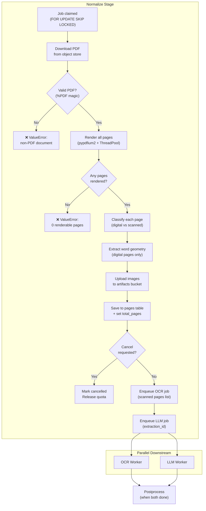
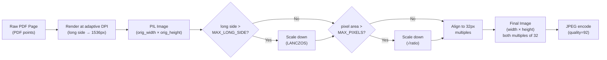

# Normalize Stage — Plain English Guide

This document explains every part of the normalize pipeline stage in plain English so any agent (Claude Code, Codex, Antigravity, etc.) can understand it without being re-explained each time.

> Source files:
> - [`worker.py:_process_normalize`](../../backend/worker.py) — orchestrator (lines 202–401)
> - [`processor.py`](../../backend/processor.py) — PDF rendering via pypdfium2
> - [`geometry.py`](../../backend/geometry.py) — per-page digital/scanned classification
> - [`pdf_extractor.py`](../../backend/pdf_extractor.py) — digital word extraction
> - [`config.py`](../../backend/config.py) — all environment-driven constants

---

## What it is

Normalize is the **first stage** of the 4-stage extraction pipeline (`normalize → ocr → llm → postprocess`). Its job is to take a raw PDF from the object store and prepare it for downstream processing: render every page to an image, classify each page as digital or scanned, extract word-level geometry for digital pages, store everything to the `pages` table, and then fan out to both OCR and LLM stages in parallel.

Normalize never calls the LLM. It never runs PaddleOCR. It only prepares the ground truth that OCR and LLM will consume.

---

## Key States

There are no user-facing states for normalize. It is an internal worker stage. The extraction status transitions during normalize are:

| Transition | When |
|---|---|
| `queued → processing` | Normalize starts |
| Document status `queued → processing` | Normalize starts downloading |
| Document status `processing → normalized` | All pages rendered and saved |

If normalize fails, the job is marked `failed` by the worker retry infrastructure, not by normalize itself.

---

## How it works — end to end

```
         ┌────────────────────────────────────────────────────────────────┐
         │                     _process_normalize                        │
         │                                                                │
         │  1. Download PDF from object store (MinIO / local fallback)    │
         │  2. Validate it starts with %PDF magic bytes                   │
         │  3. Render all pages to JPEG images via pypdfium2              │
         │     └─ Adaptive DPI per page (long side → MAX_LONG_SIDE)      │
         │     └─ Qwen3-VL budget resize (32px alignment)                │
         │  4. Classify each page: digital or scanned                    │
         │     └─ pypdfium2 text extraction → ≥50 printable chars?       │
         │     └─ YES → digital (source="pypdfium")                      │
         │     └─ NO  → scanned (source="paddleocr")                     │
         │  5. Extract word-level geometry for digital pages              │
         │     └─ Character boxes → word boxes (whitespace-delimited)     │
         │     └─ Rescale from PDF points → final image pixel space       │
         │  6. Upload page images to artifacts bucket                     │
         │  7. Save page metadata + word_geometry to `pages` table        │
         │  8. Set total_pages on extraction record                       │
         │  9. Check for cancellation                                     │
         │ 10. Enqueue TWO parallel jobs: `ocr` + `llm`                  │
         │     └─ OCR job payload includes scanned_page_numbers list      │
         │     └─ LLM job payload includes extraction_id                  │
         └────────────────────────────────────────────────────────────────┘
```

### Step-by-step

1. **Download the original PDF** from the object store (`documents` bucket) using the document's `object_key`. The raw bytes are kept in memory — no temp files.

2. **Validate the file is a PDF**. Checks two conditions: filename ends with `.pdf` AND raw bytes start with `%PDF`. If either fails, normalize raises `ValueError` with a loud message. This is defense-in-depth — every upload endpoint already runs `_require_pdf`, so a non-PDF reaching the worker means a new upload path was added without the guard.

3. **Render all pages to images** via `processor.pdf_to_images`. This uses Google's PDFium engine (pypdfium2) — Apache/BSD licensed, same rendering quality as Chrome. Rendering is offloaded to a `ThreadPoolExecutor` (default 2 workers). Each page gets:
   - **Adaptive DPI**: calculated so the long side of the rendered image hits `MAX_LONG_SIDE_PX` (default 1536px). Never goes below `DPI_FLOOR` (default 96).
   - **Qwen3-VL budget resize**: two constraints — long side ≤ `MAX_LONG_SIDE_PX` and total pixel area ≤ `MAX_PIXELS` (default 1,720,320). Whichever is tighter wins. LANCZOS resampling.
   - **32px alignment**: final dimensions are rounded to the nearest multiple of 32. This matches Qwen3-VL's internal patch size, preventing the VLM from internally padding/resizing and throwing off bounding-box coordinates.
   - **JPEG encoding** at `JPEG_QUALITY` (default 92).

4. **Classify each page as digital or scanned** via `geometry.compute_pdf_geometry`:
   - Opens the original PDF bytes again with pypdfium2 (read-only, no rendering).
   - For each page, extracts the text layer via `pdf_extractor.page_is_digital`.
   - A page is **digital** if it has ≥50 printable characters in the first 500 characters sampled. Otherwise it's **scanned**.
   - If a page is digital but yields 0 extractable word boxes (chars exist but no geometry), it's reclassified as scanned and routed to PaddleOCR.

5. **Extract word-level geometry for digital pages**:
   - Character-by-character iteration over the pypdfium2 text page.
   - Characters are accumulated into words, flushed on whitespace delimiters.
   - Boxes are in PDF point space with Y-axis flipped (top-left origin), then rescaled to the final rendered image pixel dimensions.
   - Each word is `{text, box: [x0, y0, x1, y1], score: 1.0}`.

6. **Upload page images** to the artifacts bucket under the key pattern `extractions/{extraction_id}/pages/page_{N}.jpg`.

7. **Save page metadata** to the `pages` table via `db.save_pages`. Each row stores:
   - `page_number`, `object_key`, `mime_type`
   - `width`, `height` (final rendered), `orig_width`, `orig_height` (before VLM resize)
   - `source` ("pypdfium" or "paddleocr")
   - `char_count`, `word_geometry` (JSONB — the word boxes for digital pages, NULL for scanned)
   - Uses `ON CONFLICT (extraction_id, page_number) DO UPDATE` — idempotent on retry.

8. **Set `total_pages`** on the extraction record. This is the count the SSE progress stream uses to show "page X of N".

9. **Check for cancellation**. If the user requested cancel while normalize was running, the extraction is marked `cancelled` (or `partial` if any results already exist from a previous attempt), quota is released, and a `JobCancelled` sentinel is raised.

10. **Enqueue two parallel jobs**: `ocr` and `llm`. Both are created via `ensure_job` (idempotent — unique index prevents duplicates). The OCR job payload carries `scanned_page_numbers` so OCR knows which pages to process. The LLM job just needs `extraction_id`.

---

## Architecture — Mermaid



---

## Page Classification — Decision Tree

```
                          ┌────────────────────────┐
                          │  pypdfium2 text layer   │
                          │  textpage.count_chars() │
                          └─────────┬──────────────┘
                                    │
                        ┌───────────▼───────────┐
                        │  chars < 50?          │
                        └───┬───────────────┬───┘
                          YES               NO
                            │                │
                            ▼                ▼
                     ┌──────────┐    ┌─────────────────┐
                     │ SCANNED  │    │ Sample first 500 │
                     │ needs    │    │ chars: count     │
                     │ PaddleOCR│    │ printable ones   │
                     └──────────┘    └────────┬────────┘
                                              │
                                    ┌─────────▼─────────┐
                                    │ printable >= 50?  │
                                    └──┬────────────┬───┘
                                     YES             NO
                                      │              │
                                      ▼              ▼
                               ┌────────────┐  ┌──────────┐
                               │ Extract     │  │ SCANNED  │
                               │ word boxes  │  └──────────┘
                               └──────┬─────┘
                                      │
                              ┌───────▼────────┐
                              │ words.len > 0? │
                              └──┬──────────┬──┘
                               YES           NO
                                │             │
                                ▼             ▼
                         ┌──────────┐  ┌──────────┐
                         │ DIGITAL  │  │ SCANNED  │
                         │ pypdfium │  │ fallback │
                         └──────────┘  └──────────┘
```

**Constants** (from [`pdf_extractor.py`](../../backend/pdf_extractor.py)):
- `DIGITAL_CHAR_THRESHOLD` = 50
- `DETECTION_SAMPLE_SIZE` = 500

---

## Image Resize Pipeline — Mermaid



**Why 32px alignment?** Qwen3-VL's vision encoder uses 32×32 patches. If the image isn't aligned, the VLM internally pads/resizes it, which shifts bounding-box coordinates. Pre-aligning in normalize ensures the 0–1000 coordinate grid the VLM returns maps exactly to the image we sent.

---

## Rules

- **PDF only.** Normalize rejects any non-PDF document. The `_require_pdf` guard at upload endpoints is the primary check; the worker's magic-byte check is defense-in-depth.
- **32px alignment is mandatory.** All rendered images have width and height that are multiples of 32. This prevents VLM coordinate drift.
- **Digital classification threshold: 50 printable characters.** A page with fewer than 50 printable chars in its text layer is treated as scanned, even if it has some embedded text.
- **Zero-word fallback.** A page that passes the character threshold but yields zero extractable word boxes is reclassified as scanned. This handles pages where the text layer is font-encoded but unextractable (Type 3 fonts, CID-keyed fonts without ToUnicode maps).
- **Idempotent page saves.** `save_pages` uses `ON CONFLICT DO UPDATE`. Re-running normalize for the same extraction safely overwrites previous page data.
- **Both OCR and LLM are enqueued in parallel.** Normalize does not wait for either. Both jobs start as soon as a worker picks them up. The `ensure_job` unique index prevents duplicates.
- **Cancellation is checked after rendering.** If the user cancels during rendering, normalize stops before enqueuing downstream jobs. Quota is released.
- **No page limit in normalize.** The `MAX_DOCUMENT_PAGES` limit (default 100) is enforced at upload time, not in normalize. Normalize renders whatever pages are in the PDF.
- **Memory safety.** PDFium bitmap objects are closed in `finally` blocks immediately after conversion to PIL. The PDF document handle is closed in a `finally` block. No leaked C++ heap memory.
- **Thread pool isolation.** PDF rendering runs in a `ThreadPoolExecutor` (default 2 workers), not in the async event loop. PDFium releases the GIL — real parallel rendering.
- **MLflow tracing.** Three trace spans are emitted: `pdf_rendering`, `page_classification`, `page_routing`. Each records input/output metadata for observability.

---

## All Scenarios in Plain English

### Scenario 1 — Normal digital PDF (all pages digital)

- User uploads a 3-page PDF with embedded text.
- Normalize downloads the PDF, renders 3 pages to JPEGs.
- All 3 pages have > 50 printable characters → classified as digital.
- Word geometry is extracted for all 3 pages from the PDF text layer.
- 3 page images are uploaded to MinIO. 3 rows are saved to `pages` table.
- `scanned_page_numbers` is empty. OCR job is enqueued but OCR will skip PaddleOCR (all digital). LLM job is enqueued.

### Scenario 2 — All scanned PDF (no embedded text)

- User uploads a scanned invoice (image-only PDF).
- Normalize renders 1 page. Character count is 0 → scanned.
- No word geometry is extracted (will be filled by PaddleOCR in the OCR stage).
- `scanned_page_numbers = [1]`. OCR job payload carries this list.

### Scenario 3 — Mixed PDF (some digital, some scanned)

- 5-page PDF. Pages 1–3 have embedded text, pages 4–5 are scanned images.
- Pages 1–3: digital. Word geometry extracted and saved.
- Pages 4–5: scanned. Empty word geometry saved; `scanned_page_numbers = [4, 5]`.
- OCR will only process pages 4 and 5.

### Scenario 4 — PDF with pages that have text but no extractable words

- Page has a Type 3 font (characters exist, but pypdfium2 can't extract word bounding boxes).
- Character count is 200 → passes threshold → classified as digital initially.
- Word extraction yields 0 words → reclassified as scanned.
- Page is added to `scanned_page_numbers` for PaddleOCR.

### Scenario 5 — Corrupt PDF (cannot be opened)

- The file bytes don't parse as a valid PDF.
- pypdfium2 raises an exception during `PdfDocument()`.
- `processor.py` wraps it in `ValueError("PDF could not be opened (corrupt or unsupported format)")`.
- Normalize fails, job is marked failed by the worker retry infrastructure.

### Scenario 6 — PDF where every page fails to render

- All pages have invalid dimensions (0×0) or throw rendering errors.
- Each page is skipped individually (logged as warning).
- After the loop, `results` is empty but `render_count > 0`.
- `processor.py` raises `ValueError("PDF_RENDER_FAILED: All N page(s) failed to render")`.

### Scenario 7 — Partially renderable PDF

- 4-page PDF. Pages 1–3 render fine, page 4 has a corrupt stream.
- Page 4 is skipped with a warning. `results` has 3 pages.
- Normalize proceeds with the 3 rendered pages. No error raised.

### Scenario 8 — Non-PDF document reaches the worker

- A `.docx` or image file somehow bypasses the upload guard.
- Magic-byte check fails: `raw` doesn't start with `%PDF`.
- Normalize raises `ValueError("Worker received non-PDF document")` immediately.
- This error message includes a diagnostic hint to check the upload endpoint.

### Scenario 9 — User cancels during normalize

- User clicks cancel in the UI while pages are rendering.
- After rendering completes, normalize checks `is_cancel_requested`.
- Extraction is marked `cancelled`. Quota is released.
- `JobCancelled` sentinel is raised. OCR and LLM jobs are NOT enqueued.

### Scenario 10 — Large PDF with many pages

- 80-page PDF (within the MAX_DOCUMENT_PAGES=100 limit).
- All 80 pages are rendered, classified, and saved.
- Each page gets adaptive DPI (smaller pages get higher DPI to remain readable).
- 80 rows in `pages` table. OCR and LLM are enqueued as usual.

### Scenario 11 — Normalize job retry after failure

- First attempt fails (e.g., MinIO was temporarily down during download).
- Worker retry logic picks up the job again (up to `max_attempts`).
- `save_pages` uses `ON CONFLICT DO UPDATE` — re-inserting pages is safe.
- Page images are re-uploaded (overwrites in MinIO are fine).
- Normal flow continues from step 1.

---

## Error Responses

Normalize is an internal worker stage — it doesn't return HTTP responses directly. Errors surface as job failures visible in the extraction's `error` field.

| Situation | Error | Effect |
|---|---|---|
| Document not found in DB | `ValueError("Document not found for normalize job")` | Job fails. Extraction stays in `queued`. |
| Non-PDF file reaches worker | `ValueError("Worker received non-PDF document: '...'")` | Job fails. |
| PDF cannot be opened (corrupt) | `ValueError("PDF could not be opened (corrupt or unsupported format)")` | Job fails. |
| All pages fail to render | `ValueError("PDF_RENDER_FAILED: All N page(s) failed to render")` | Job fails. |
| Zero renderable pages (empty PDF) | `ValueError("Document '...' produced 0 renderable pages")` | Job fails. |
| Object store download failure | Exception from `store.get_bytes()` | Job fails, eligible for retry. |
| Cancellation during rendering | `JobCancelled("Cancelled during page rendering")` | Extraction → cancelled. Quota released. |

---

## Test Coverage

Normalize is tested in [`tests/test_pipeline_hardening.py`](../../tests/test_pipeline_hardening.py) and [`tests/test_pipeline_integration_flow.py`](../../tests/test_pipeline_integration_flow.py). All DB calls are mocked — no live database or object store needed.

### What is tested and why

**WorkerPipelineTests** — `test_pipeline_hardening.py`

| Test | What it proves |
|---|---|
| `test_normalize_job_updates_progress_with_pool_and_saves_object_rows` | Normalize sends the correct progress dict (`stage: normalize`, `message: Downloading original document`) to `update_job_progress`, and that saved page rows have `page_number`, `object_key`, and `mime_type` fields |

**WorkerFlowIntegrationTests** — `test_pipeline_integration_flow.py`

| Test | What it proves |
|---|---|
| `test_full_pipeline_flow_populates_extraction_artifacts` | Full 4-stage pipeline (normalize → ocr → llm → postprocess) runs end-to-end with mocked dependencies. After normalize: `total_pages` is set to 2, page images are stored in the fake object store, ensured jobs include `["ocr", "llm", "postprocess"]` in that order |

---

## Configuration Parameters

All parameters live in [`config.py`](../../backend/config.py) and are driven by environment variables.

| Parameter | Env Var | Default | Purpose |
|---|---|---|---|
| `MAX_LONG_SIDE_PX` | `MAX_LONG_SIDE_PX` | 1536 | Target long-side pixel count for rendered pages |
| `MAX_PIXELS` | `MAX_PIXELS` | 1,720,320 | Maximum total pixel area (width × height) |
| `JPEG_QUALITY` | `JPEG_QUALITY` | 92 | JPEG compression quality for page images |
| `DPI_FLOOR` | `DPI_FLOOR` | 96 | Minimum DPI — small pages (receipts) won't go lower |
| `DPI_DEFAULT` | `DPI_DEFAULT` | 128 | Starting DPI before adaptive per-page calculation |
| `PDF_WORKERS` | `PDF_WORKERS` | 2 | ThreadPoolExecutor size for PDF rendering |
| `DIGITAL_CHAR_THRESHOLD` | — | 50 | Min printable chars for a page to be classified as digital |
| `DETECTION_SAMPLE_SIZE` | — | 500 | Max chars sampled for digital detection |

---

## Data Flow — Pages Table Schema

```sql
CREATE TABLE pages (
    id              SERIAL PRIMARY KEY,
    extraction_id   INT NOT NULL REFERENCES extractions(id) ON DELETE CASCADE,
    page_number     INT NOT NULL,
    object_key      TEXT NOT NULL,        -- "extractions/21/pages/page_1.jpg"
    mime_type       TEXT DEFAULT 'image/jpeg',
    width           INT DEFAULT 0,        -- final rendered width (32px-aligned)
    height          INT DEFAULT 0,        -- final rendered height (32px-aligned)
    orig_width      INT DEFAULT 0,        -- pre-VLM-resize width
    orig_height     INT DEFAULT 0,        -- pre-VLM-resize height
    source          TEXT,                  -- 'pypdfium' or 'paddleocr'
    char_count      INT,                  -- pypdfium2 character count
    word_geometry   JSONB,                -- [{text, box:[x0,y0,x1,y1], score}] for digital pages
    UNIQUE(extraction_id, page_number)
);
```

---

## Quick Reference Table

| Situation | What happens | Notes |
|---|---|---|
| Digital PDF (all pages have text) | Word geometry extracted from PDF, OCR skipped | Fastest path — no PaddleOCR overhead |
| Scanned PDF (no embedded text) | Pages marked as scanned, OCR will run PaddleOCR | Slightly slower — needs OCR stage |
| Mixed PDF | Digital pages get geometry, scanned pages get OCR | Both sources merge in OCR stage |
| Corrupt PDF | `ValueError` — job fails | Will retry up to `max_attempts` |
| Non-PDF file | `ValueError` — loud error, job fails | Defense-in-depth check |
| Single bad page in otherwise good PDF | Bad page skipped, rest processed normally | Warning logged per skipped page |
| Cancellation during normalize | OCR and LLM NOT enqueued, quota released | Clean abort |
| Retry after failure | Idempotent — `ON CONFLICT DO UPDATE` on pages | Safe to re-run |
| Large PDF (e.g. 80 pages) | All pages rendered, adaptive DPI per page | Each page gets optimal resolution |
| Page with text but no word boxes | Reclassified from digital → scanned | Falls back to PaddleOCR |
