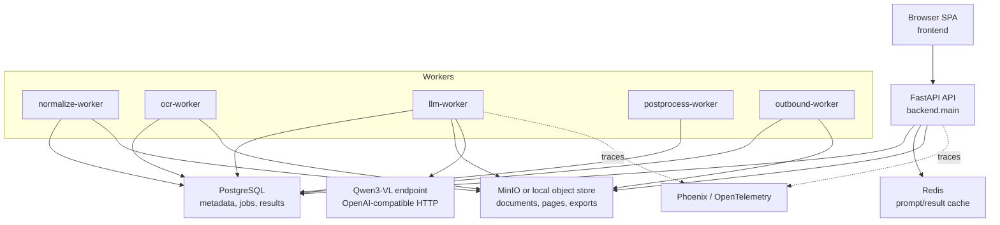
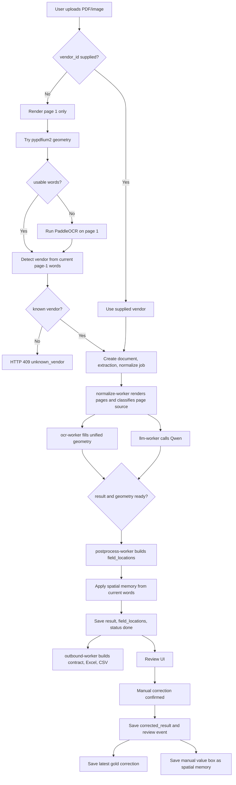
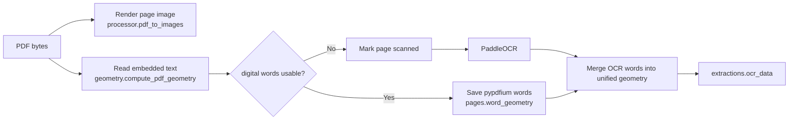
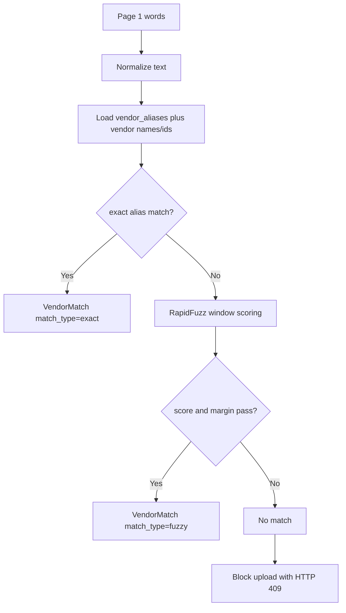
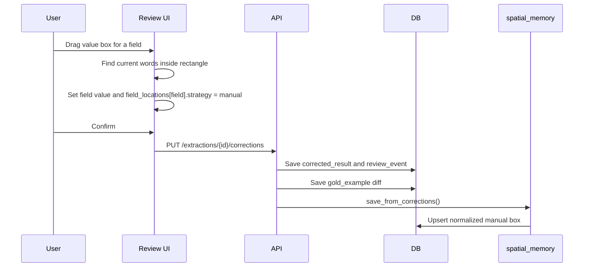
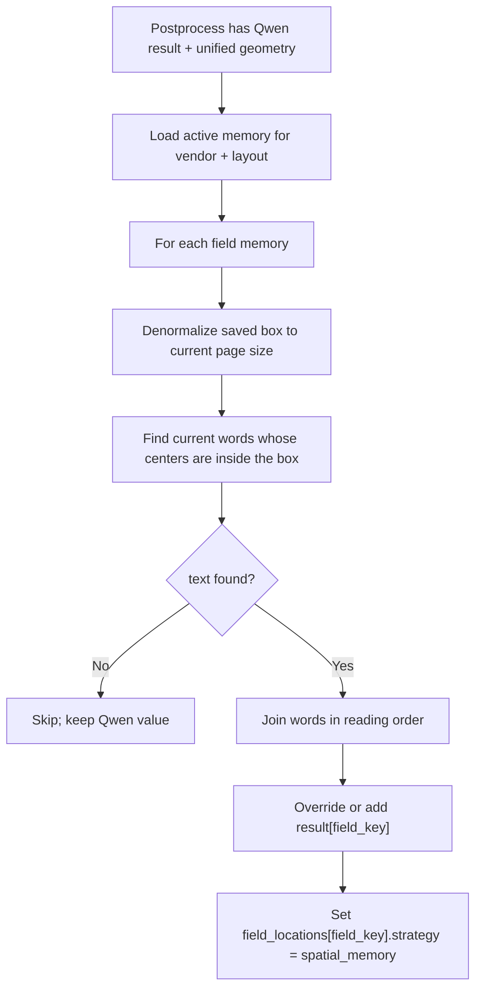
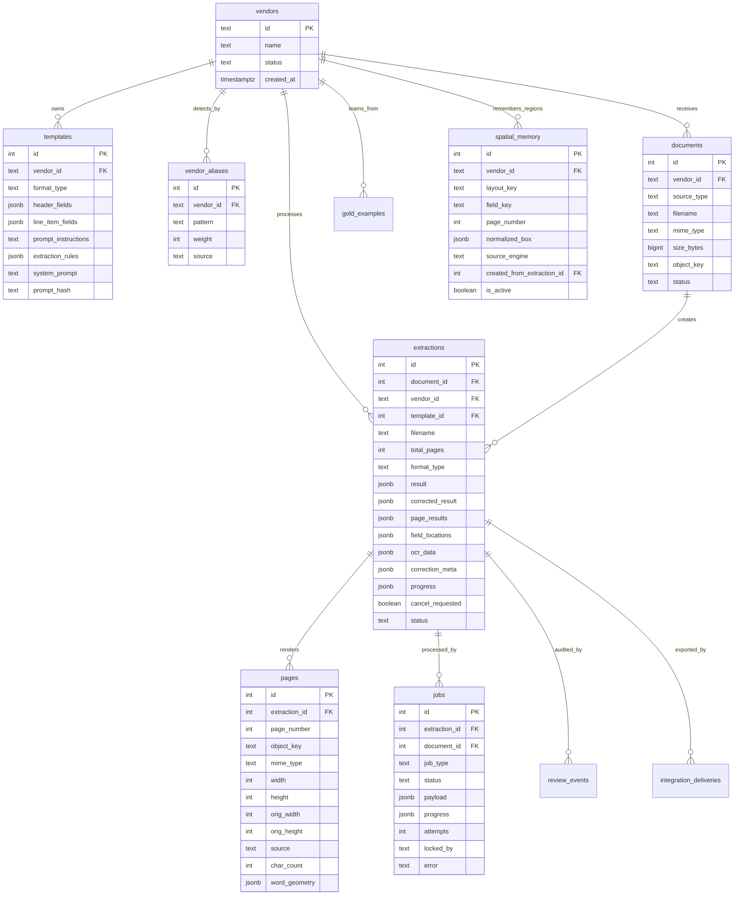
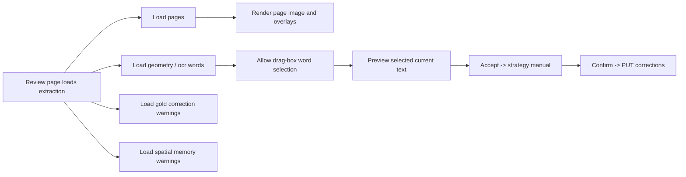

# Augmented OCR - System Specification

Version: 4.0
Updated: 2026-04-27
Status: Current implementation plus active hardening plan

This file is the living specification for the current codebase. It describes
what is implemented now, what is intentionally planned next, and how the
important functions fit together.

## 1. Current Product Goal

Augmented OCR extracts structured purchase order data from PDFs and images.
The system lets a user upload a document before selecting a vendor. It detects
the vendor from page 1, routes each page through digital text extraction or
OCR, asks Qwen3-VL for semantic extraction plus anchor boxes, and lets a human
reviewer correct values visually.

Manual review must create reusable geometry memory, not answer memory.

Core rules:

| Rule | Current behavior |
|---|---|
| Upload first | `/ingest/ui` accepts `vendor_id` as optional and detects vendor when missing. |
| Unknown vendor | Detection failure returns HTTP 409 with a create-vendor hint. |
| Digital pages | PDF pages are rendered and inspected with `pypdfium2`; usable embedded words are stored as page geometry. |
| Scanned pages | Pages without usable digital geometry are routed to PaddleOCR. |
| Mixed PDFs | Page source is stored per page, so one document can contain both `pypdfium` and `paddleocr` pages. |
| Qwen role | Qwen extracts JSON values and anchor/header boxes only. It is not trusted for exact value geometry. |
| Review role | Human edits and manual drag boxes produce `corrected_result`, audit events, gold examples, and spatial memory. |
| Spatial memory role | Store the field region. On the next document, read current words inside that region. Never reuse the old value. |
| Gold examples role | Prompt hints for repeated formatting mistakes. Prompt injection uses the latest correction per field. |
| Logging | `backend/logging_config.py` owns console logging and JSONL pipeline audit logging. |

## 2. Implemented vs Planned

| Area | Implemented now | Planned hardening |
|---|---|---|
| PDF rendering | `processor.py` uses `pypdfium2` and Pillow, not PyMuPDF/fitz. | Keep PDFium as the supported renderer. |
| Digital detection | `pdf_extractor.page_is_digital()` checks printable embedded text. | Require both `char_count >= threshold` and `word_count >= threshold` before marking digital. |
| OCR fallback | Pages classified as scanned are sent to PaddleOCR. | If digital extraction returns too few usable words, force PaddleOCR fallback for that page. |
| Unified geometry | `ocr_data` stores pages shaped as `{page_number, source, char_count, word_count, words}`. | Rename frontend usage from OCR wording to geometry wording over time. |
| Vendor detection | Exact aliases first, RapidFuzz second, unknown blocks. | Add an alias-management UI if needed. |
| Layout key | Effective key is `vendor_id:template_id`; DB column remains `layout_key`. | If a client later has multiple formats, upgrade the key with stable layout anchors. |
| Spatial memory save | Saves only `strategy == "manual"` drag boxes. | Add UI visibility for active saved regions if useful. |
| Spatial memory apply | Reads current words inside saved box and overrides Qwen value. | Add stronger stale-region checks and optional proximity expansion. |
| Gold examples | Append-only audit table; prompt gets latest correction per field. | Add UI delete/deactivate for wrong gold examples. |
| Debug dumps | Postprocess still writes `bbox/pdle_output` and `bbox/qwn_output`. | Gate behind env var or move to structured logs/object storage. |
| Job enqueue | `ensure_job()` checks active job before insert. | Add DB-level partial unique index for active jobs. |
| Vendor delete | DB rows are deleted. | Also delete associated document/page/export objects from object storage. |

## 3. Architecture



## 4. End-to-End Pipeline



## 5. Page Routing and Geometry

Every page must be represented in one unified schema:

```json
{
  "page_number": 1,
  "source": "pypdfium",
  "char_count": 1234,
  "word_count": 240,
  "words": [
    {"text": "ROBERT", "box": [10, 20, 80, 40], "score": 1.0}
  ]
}
```

`source` is either:

| Source | Meaning |
|---|---|
| `pypdfium` | Digital page. Words came from embedded PDF text and were scaled into rendered image coordinates. |
| `paddleocr` | Scanned/image page. Words came from OCR on the rendered image. |



Current caveat: the code still treats a page as digital based primarily on
printable embedded characters. The planned rule is to require both enough
characters and enough extracted word boxes.

## 6. Vendor Detection

Detection uses only current-document text from page 1.



The API returns `detected_vendor` with `vendor_id`, `vendor_name`,
`match_type`, `score`, and matched patterns when ingest auto-detects a client.

## 7. Qwen Contract

Qwen is asked to return exactly two top-level keys:

```json
{
  "fields": {
    "supplier": "Fresh Products LLC",
    "line_items": [{"no": 105321, "qty": 45}]
  },
  "boxes": {
    "supplier": [10, 20, 90, 40],
    "no": [20, 500, 55, 525]
  }
}
```

Important boundaries:

| Thing | Responsible component |
|---|---|
| Semantic field values | Qwen |
| Header field anchor boxes | Qwen |
| Line item column header boxes | Qwen |
| Exact value boxes | pypdfium/PaddleOCR words plus manual selection |
| Reused corrected field location | Spatial memory |
| Corrected final answer | Human review / current words inside spatial memory box |

Qwen boxes are normalized `0..1000` anchor/header boxes. They are not value
boxes and must not be stored as spatial memory.

## 8. Review, Spatial Memory, and Gold Corrections



Spatial memory identity:

```text
vendor_id + template_id + field_key + page_number
```

The DB still stores `layout_key`, but current phase-one logic computes:

```text
layout_key = "{vendor_id}:{template_id or default}"
```

Spatial memory apply flow:



Gold corrections are separate:

| Mechanism | Stores old corrected value? | Used as future answer? | Purpose |
|---|---:|---:|---|
| Gold examples | Yes, in audit rows | No | Prompt hints for recurring formatting mistakes |
| Spatial memory | No, only region geometry | Yes, but by reading current text | Deterministic value reuse |

Prompt construction fetches one latest correction per field so old conflicting
examples do not accumulate in the prompt.

## 9. Logging

There is one logging module:

```text
backend/logging_config.py
```

It provides:

| Function | Purpose |
|---|---|
| `configure_logging()` | Configure standard console logging. |
| `get_logger(name)` | Return normal Python logger. |
| `event()` | Write one structured pipeline event as JSONL. |
| `timed()` | Context manager that writes an event with duration. |
| `log_paths()` | Return central and per-extraction log paths. |

Log outputs:

| File | Meaning |
|---|---|
| `logs/pipeline/pipeline.jsonl` | Central chronological pipeline stream. |
| `logs/pipeline/extractions/extraction_<id>.jsonl` | Per-extraction timeline. |

Pipeline logging is JSONL: one complete JSON object per line.

Example:

```json
{"ts":"2026-04-27T11:38:04.123Z","event":"vendor_matched","stage":"vendor_detection","status":"ok","filename":"ROBERT.pdf","duration_ms":12.4,"details":{"vendor_id":"105240","match_type":"exact"}}
```

## 10. Data Model



## 11. API Surface

| Method | Path | Purpose |
|---|---|---|
| `GET` | `/health` | Health check. |
| `GET` | `/vendors` | List vendors. |
| `POST` | `/vendors` | Upsert vendor and auto-create aliases from name/id. |
| `DELETE` | `/vendors/{vendor_id}` | Delete vendor DB rows. Object cleanup is planned. |
| `POST` | `/detect-vendor` | Standalone page-1 vendor detection. |
| `GET` | `/vendors/{vendor_id}/template` | Load vendor template. |
| `POST` | `/vendors/{vendor_id}/template` | Save template and rebuild/cache prompt. |
| `GET` | `/vendors/{vendor_id}/gold-corrections` | Latest gold correction fields for UI warning. |
| `GET` | `/extractions/{id}/spatial-memory-fields` | Active spatial-memory fields for UI warning. |
| `POST` | `/ingest/{source_type}` | Durable ingest. `vendor_id` optional for upload-first flow. |
| `GET` | `/jobs/{job_id}` | One-shot job status. |
| `GET` | `/jobs/{job_id}/stream` | SSE progress stream. |
| `POST` | `/jobs/extractions/{id}/cancel` | Cancel active extraction. |
| `POST` | `/jobs/extractions/{id}/resume` | Resume failed/partial extraction. |
| `GET` | `/extractions` | Global extraction history. |
| `GET` | `/vendors/{vendor_id}/extractions` | Vendor extraction history. |
| `GET` | `/extractions/{id}` | Full extraction record. |
| `DELETE` | `/extractions/{id}` | Delete extraction and related object artifacts. |
| `GET` | `/extractions/{id}/pages` | Rendered page images. |
| `GET` | `/extractions/{id}/ocr` | Legacy geometry endpoint name, returns `ocr_pages`. |
| `GET` | `/extractions/{id}/geometry` | Unified geometry endpoint. |
| `PUT` | `/extractions/{id}/corrections` | Save review corrections, gold examples, spatial memory. |
| `GET` | `/extractions/{id}/reviews` | Review audit trail. |
| `GET` | `/extractions/{id}/contract` | Normalized purchase order contract. |
| `GET` | `/extractions/{id}/export.xlsx` | Excel export. |
| `GET` | `/extractions/{id}/export.csv` | CSV export. |
| `POST` | `/upload-preview` | Render preview pages without extraction. |

Deprecated legacy endpoints:

| Method | Path | Replacement |
|---|---|---|
| `POST` | `/extract` | `/ingest/ui` |
| `POST` | `/extract/cancel/{id}` | `/jobs/extractions/{id}/cancel` |
| `POST` | `/extract/resume/{id}` | `/jobs/extractions/{id}/resume` |

## 12. Frontend Behavior

The SPA uses hash routing and lives in `frontend/app.js`.

| Route | Purpose |
|---|---|
| `#/vendors` | Create/delete vendors. |
| `#/template/{vendor_id}` | Configure format, header fields, line columns, prompt instructions, rules. |
| `#/saved-templates` | View saved templates. |
| `#/extract` | Upload document, auto-detect vendor, stream pipeline progress. |
| `#/history` | Extraction history. |
| `#/review/{id}` | Three-column review UI with page viewer, field list, JSON output. |

Review strategies displayed by the UI:

| Strategy | Meaning |
|---|---|
| `qwen_anchor` | Qwen returned an anchor/header box for a header field. |
| `qwen_column_header` | Qwen returned a table column header box. |
| `qwen_anchor_missing` | Field has value but no Qwen anchor. |
| `qwen_column_header_missing` | Line-item value has no Qwen column header box. |
| `manual` | User drew a manual value box. Only this can be saved as spatial memory. |
| `spatial_memory` | Backend reused a saved box and read current words inside it. |



## 13. Function Reference - Backend

This section lists production backend functions and their responsibilities.

### `backend/processor.py`

| Function | Responsibility |
|---|---|
| `_resize_to_vlm_budget` | Resize rendered images to Qwen3-VL long-side and area budgets, aligned to 32 px. |
| `_render_pdf_sync` | Render PDF pages to JPEG base64 using pypdfium2/PDFium. |
| `_resize_image_sync` | Normalize a non-PDF image upload to one JPEG page. |
| `pdf_to_images` | Async wrapper for PDF rendering. |
| `image_file_to_b64` | Async wrapper for image normalization. |

### `backend/pdf_extractor.py`

| Function | Responsibility |
|---|---|
| `compute_scale` | Match PDFium render scale used for text coordinate conversion. |
| `page_is_digital` | Decide whether embedded text appears printable enough to treat as digital. |
| `extract_words` | Convert pypdfium2 character boxes into word boxes in image pixel space. |

### `backend/geometry.py`

| Function | Responsibility |
|---|---|
| `_rescale_words` | Scale extracted word boxes into final rendered image coordinates. |
| `_digital_words_for_page` | Extract and classify one PDF page as digital or scanned. |
| `compute_pdf_geometry` | Build unified geometry entries for all PDF pages. |
| `merge_scanned_into_geometry` | Fill scanned-page geometry entries with PaddleOCR words. |
| `image_page_geometry` | Return an empty scanned placeholder for image uploads. |

### `backend/ocr_runner.py`

| Function | Responsibility |
|---|---|
| `_get_ocr_engine` | Thread-local lazy initialization for PaddleOCR. |
| `_run_ocr_on_page` | OCR one rendered page and return text boxes. |
| `run_ocr_on_pages` | Run OCR across pages using an executor and aggregate results. |

### `backend/vendor_detector.py`

| Function/Class | Responsibility |
|---|---|
| `VendorMatch` | Data object returned by detection. |
| `_normalize_text` | Normalize OCR/PDF text and aliases for matching. |
| `_alias_variants` | Produce normalized alias strings. |
| `_text_windows` | Build candidate token windows for fuzzy matching. |
| `_pattern_is_safe_for_fuzzy` | Reject tiny/numeric patterns for fuzzy matching. |
| `_best_window_score` | Find the best RapidFuzz score for an alias. |
| `_effective_fuzzy_score` | Adjust fuzzy score based on pattern distinctiveness. |
| `_load_detection_aliases` | Load aliases plus vendor names/ids from DB. |
| `_detect_exact` | Score exact alias matches. |
| `_detect_fuzzy` | Score fuzzy matches and reject ambiguous margins. |
| `detect_vendor` | Public detector: exact first, fuzzy second, unknown otherwise. |

### `backend/layout_key.py`

| Function | Responsibility |
|---|---|
| `compute_layout_key` | Return stable phase-one layout key `vendor_id:template_id`. |

### `backend/spatial_memory.py`

| Function | Responsibility |
|---|---|
| `_configured_field_names` | Parse configured header field names from template/extraction data. |
| `_load_configured_header_fields` | Load dynamic reusable header fields for the vendor/template. |
| `_is_reusable_header_field` | Reject line-item fields and accept configured top-level header fields. |
| `_normalize_box` | Convert pixel box to normalized 0..1 coordinates. |
| `_denormalize_box` | Convert normalized box back to current page pixels. |
| `_words_in_box` | Select current words whose centers fall inside a box. |
| `_reading_order` | Sort matched words top-to-bottom and left-to-right. |
| `save_from_corrections` | Persist manual drag-box field regions as spatial memory. |
| `apply_to_extraction` | Read current text inside saved regions and override Qwen values. |

### `backend/extractor.py`

| Function | Responsibility |
|---|---|
| `build_system_prompt` | Build reusable Qwen system prompt with fields, rules, format, and gold examples. |
| `build_user_message` | Build page-specific user message and required JSON schema. |
| `compute_prompt_hash` | Hash prompt inputs, version, and latest gold examples. |
| `get_or_build_system_prompt` | Resolve prompt from Redis, DB, or rebuild and cache it. |
| `call_llm` | Send one page to Qwen and parse valid JSON. |
| `extract_document` | Orchestrate page-by-page extraction with resume/cancel support. |
| `merge_results` | Merge page results according to document format. |

### `backend/qwen_bbox_parser.py`

| Function | Responsibility |
|---|---|
| `_valid_box` | Validate Qwen 4-number normalized boxes. |
| `_denormalize_box` | Convert Qwen 0..1000 box to image pixels. |
| `parse_qwen_page_result` | Extract `fields` and `boxes` from one Qwen page result. |
| `build_field_locations` | Convert Qwen anchor/header boxes into review `field_locations`. |

### `backend/text_matcher.py`

This is the legacy/fallback field-location engine used when Qwen v3 boxes are
not available.

| Function group | Responsibility |
|---|---|
| `_normalize_text`, `_normalize_token`, `_normalize_token_loose`, `_normalize_field_key`, `_get_field_aliases` | Normalize text, tokens, and field names for matching. |
| `_valid_box`, `_box_union`, `_box_center_x`, `_box_center_y`, `_box_area`, `_int_box`, `_boxes_close`, `_box_contains`, `_estimate_sub_box`, `_box_is_sane` | Geometry helpers for boxes and sub-boxes. |
| `_choose_best`, `_tokenize_with_spans`, `_build_token_stream`, `_match_token_sequence`, `find_value_in_ocr` | Locate field values in OCR text using exact, span, and fuzzy matching. |
| `_classify_confidence`, `_is_empty_value`, `_split_value_lines`, `_median_int`, `_prepare_page_words`, `_build_ocr_lines`, `_box_from_location` | Prepare words/lines and classify match quality. |
| `_anchor_strength`, `_compute_value_frequencies`, `_get_column_names`, `_group_items_by_page`, `_strategy_priority` | Score row/column anchors for line-item mapping. |
| `_find_page_column_headers`, `_find_row_anchors`, `_build_row_bands`, `_confirm_column`, `_generate_header_variants`, `_find_column_header_in_ocr`, `_build_column_anchor_box`, `_reserve_source_boxes_for_hit` | Table header and row band detection. |
| `compute_field_locations` | Public fallback that returns review `field_locations`. |

### `backend/worker.py`

| Function | Responsibility |
|---|---|
| `_pipeline_base` | Build shared logging context. |
| `_load_pages` | Load rendered page images from object storage. |
| `_stop_if_cancelled` | Stop a stage when cancellation was requested. |
| `_maybe_enqueue_postprocess` | Enqueue postprocess after both result and geometry are ready. |
| `_process_normalize` | Render pages, compute digital/scanned geometry, save page metadata, enqueue OCR and LLM. |
| `_process_ocr` | Run OCR only on scanned pages and save unified geometry. |
| `_process_llm` | Load template/prompt, call Qwen, save result and page results. |
| `_process_postprocess` | Build field locations, apply spatial memory, save mapping, mark done. |
| `_process_outbound` | Build contract, Excel, CSV, and delivery records. |
| `process_job` | Dispatch a claimed job to its stage handler. |
| `run_worker` | Poll and claim jobs, log completion/failure. |
| `main` | CLI entrypoint for stage-specific worker process. |

### `backend/main.py`

| Function/Class | Responsibility |
|---|---|
| `MaxUploadSizeMiddleware` | Reject uploads larger than configured size. |
| `lifespan` | Initialize DB, Redis, object store, and tracing. |
| `_guess_mime_type` | Infer content type from filename. |
| `_load_page_payloads` | Read rendered pages for legacy direct extraction/resume paths. |
| `_submit_ingestion_job` | Store upload, create document/extraction, enqueue normalize job. |
| `global_exception_handler` | Return JSON for unhandled API errors. |
| `health` | Health endpoint. |
| `list_vendors`, `create_vendor`, `delete_vendor` | Vendor CRUD and alias seeding. |
| `detect_vendor_endpoint` | Standalone vendor detection upload path. |
| `get_template`, `save_template`, `list_all_templates` | Template load/save/list. |
| `get_vendor_gold_corrections` | Return latest gold correction fields for frontend warnings. |
| `get_spatial_memory_fields` | Return active spatial-memory fields for frontend warnings. |
| `extract`, `cancel_extraction`, `resume_extraction` | Legacy synchronous extraction/cancel/resume paths. |
| `ingest_document` | Durable upload-first ingestion path. |
| `get_job_status`, `stream_job_status_sse` | Job status and SSE progress. |
| `request_job_cancel`, `queue_resume_extraction` | Durable cancel/resume endpoints. |
| `get_extraction`, `delete_extraction` | Read/delete extraction records and artifacts. |
| `get_extraction_pages`, `get_extraction_ocr`, `get_extraction_geometry` | Serve page images and word geometry. |
| `list_vendor_extractions`, `list_all_extractions` | History endpoints. |
| `upload_preview` | Render preview pages without creating extraction jobs. |
| `_normalize_str`, `_compute_correction_diff` | Review diff helpers. |
| `save_extraction_corrections` | Persist review result, gold example, and spatial memory. |
| `get_extraction_reviews` | Return review audit trail. |
| `get_extraction_contract` | Return normalized contract. |
| `download_extraction_excel`, `download_extraction_csv` | Return generated exports. |

### `backend/db.py`

| Function group | Responsibility |
|---|---|
| `create_pool`, `init` | Connect to Postgres and create/migrate tables. |
| `_parse_jsonb`, `_record` | Convert asyncpg records and JSONB strings to dicts. |
| Vendor functions | `get_vendor`, `list_vendors`, `upsert_vendor`, `delete_vendor`. |
| Alias functions | `insert_vendor_alias`, `list_vendor_aliases`, `delete_vendor_alias`, `get_all_aliases_for_detection`. |
| Spatial memory functions | `upsert_spatial_memory`, `get_spatial_memory_for_layout`, `deactivate_spatial_memory`. |
| Template functions | `get_template`, `upsert_template`, `list_all_templates`. |
| Document functions | `create_document`, `get_document`, `update_document_status`, `delete_document`. |
| Extraction functions | `create_extraction`, `update_extraction_result`, `list_extractions`, `list_all_extractions`, `get_extraction`, `delete_extraction`. |
| Page/geometry functions | `save_pages`, `get_pages`, `get_page_object_keys`, `save_ocr_data`, `get_ocr_data`, `is_postprocess_ready`. |
| Object key functions | `list_delivery_object_keys`, `get_vendor_object_keys`. |
| Review functions | `save_field_locations`, `save_corrections`, `get_effective_result`, `create_review_event`, `list_review_events`. |
| Gold functions | `save_gold_example`, `get_gold_examples`, `get_latest_gold_correction_fields`. |
| Job functions | `enqueue_job`, `has_active_job`, `ensure_job`, `claim_job`, `update_job_progress`, `complete_job`, `fail_job`, `cancel_jobs_for_extraction`, `get_job`, `get_latest_job_for_extraction`, `list_jobs_for_extraction`. |
| Status/delivery functions | `set_extraction_status`, `update_extraction_progress`, `set_total_pages`, `set_cancel_requested`, `is_cancel_requested`, `upsert_delivery`, `list_deliveries`, `save_export_artifact`. |

### Support modules

| File | Function/Class | Responsibility |
|---|---|---|
| `cache.py` | `get_redis`, prompt cache functions, extraction cache functions | Redis connection and cache helpers. |
| `contracts.py` | `_header_fields`, `_document_payload`, `_multi_document_export_rows`, `build_purchase_order_contract` | Build canonical downstream purchase-order contract. |
| `exporter.py` | `_stringify`, `_header_pairs`, `_line_items_table`, style helpers, `build_excel_bytes`, `build_csv_bytes` | Build Excel and CSV exports. |
| `object_store.py` | `ObjectStore`, `get_store` | MinIO/local object storage with path validation. |
| `models.py` | Pydantic classes | API request/response schemas. |
| `phoenix_tracing.py` | `trace_*` context managers and setup helpers | Optional OpenTelemetry/Phoenix tracing. |

## 14. Function Reference - Frontend

Only the main production functions are listed; CSS selectors and simple global
state variables are not function logic.

### Router and utilities

| Function | Responsibility |
|---|---|
| `toggleTheme` | Switch light/dark theme. |
| `apiFetch`, `apiJSON` | Fetch wrappers for API calls and JSON parsing. |
| `formatDurationMs`, `setText`, `escapeHtml`, `escapeJsString`, `escapeInlineJsString`, `safeClassToken`, `safeMimeType` | Formatting and safe rendering helpers. |
| `showToast` | Show transient UI status. |
| `navigate`, `getRoute`, `router`, `headerHTML`, `updateNavActive` | Hash routing and navigation rendering. |

### Vendor and template pages

| Function | Responsibility |
|---|---|
| `renderVendorsPage`, `renderVendorCards`, `deleteVendor`, `vendorModalHTML`, `openAddVendor`, `closeModal`, `saveNewVendor` | Vendor page behavior. |
| `renderTemplatePage`, `tplAddHeader`, `tplRemoveHeader`, `tplRenderHeaders`, `tplAddLine`, `tplRemoveLine`, `tplRenderLines`, `tplAddRule`, `tplAddRuleText`, `tplRemoveRule`, `tplRenderRules`, `updateTplFormatHint`, `saveTplConfig` | Template editor behavior. |
| `renderSavedTemplatesPage` | Saved templates page. |

### Extract page and pipeline stream

| Function | Responsibility |
|---|---|
| `renderExtractPage` | Render upload-first extract page. |
| `extSetVendor`, `setDetectedVendorDisplay`, `extLoadVendorConfig` | Vendor/template display and loading after detection. |
| `addHeaderField`, `removeHeaderField`, `renderHeaderFields`, `addLineItemField`, `removeLineItemField`, `renderLineItemFields`, `renderBottomBar`, `addRule`, `deleteRule`, `renderRules`, `saveTemplate`, `extUpdateFormatHint` | Dynamic field/rule controls. |
| `setupDropzone`, `handleFile`, `updatePageNav`, `changePage`, `renderCurrentPage`, `setupDragZoom`, `applyZoom` | File preview and zoom/pan controls. |
| `buildPipelineHTML`, `showPipelinePanel`, `hidePipelinePanel`, `setPipelineStage`, `setPipelineProgress`, `updatePipelineFromSSE` | Visual pipeline progress UI. |
| `showStopButton`, `resetExtractButtons`, `cancelExtract`, `showResumeButton`, `applyJobStatus`, `streamJob`, `runExtract`, `resumeExtract`, `retryLastExtract` | Durable job interaction and SSE handling. |
| `showResult`, `loadExtractionPages`, `copyResult`, `downloadResult`, `downloadExcel`, `downloadCsv`, `setStatus` | Extraction result display and downloads. |

### History page

| Function | Responsibility |
|---|---|
| `renderHistoryPage` | Render extraction history. |
| `deleteExtractionSafe` | Confirm and delete one extraction. |
| `showHistoryDetailSafe` | Load and display one extraction details. |

### Review page

| Function | Responsibility |
|---|---|
| `renderReviewPage` | Load extraction, pages, geometry, correction warnings, and render review UI. |
| `_cloneJson`, `_normalizeReviewRecord`, `_rvCurrentPayload`, `_rvRecordIndexForPage`, `_rvPersistCurrentRecord`, `_rvLoadCurrentRecord`, `_rvHeaderKeys`, `_rvUpdateStats`, `_rvSetCurrentPage` | Review state helpers, including `po_per_page` support. |
| `rvGetDotClass`, `rvIsLowConfidenceLoc`, `rvGetLineItemCellClass`, `_isFieldChanged` | Review status/quality styling. |
| `rvRenderFields`, `rvOnFieldEdit`, `rvUpdateJSON`, `rvRenderLineItems`, `rvRenderCurrentPage`, `rvOnImageLoad` | Review field, JSON, table, and page rendering. |
| `rvRenderMappingRects`, `rvRenderMappingLines`, `rvHighlight`, `rvClearHighlight`, `rvFocusField` | Overlay rectangles, connector lines, and highlighting. |
| `rvStartSelection`, `rvCancelSelection`, `rvSetupSelectionMode`, `rvFindWordsInRect`, `rvHighlightOcrWordsInRect`, `rvApplySelection`, `_rvShowSelectionPreview`, `rvAcceptSelection`, `rvRejectSelection` | Manual drag-box correction workflow. |
| `rvResetField`, `rvUndo` | Revert a field or undo the last correction. |
| `rvSetupAltOverlay`, `rvShowOcrOverlay`, `rvHideOcrOverlay` | Alt-key OCR word overlay. |
| `rvChangePage`, `rvUpdatePageNav`, `rvSetupDragZoom`, `rvApplyZoom` | Review page navigation and zoom. |
| `rvCopyJSON`, `rvDownloadJSON`, `rvConfirm` | JSON export and correction save. |

## 15. Observability Checklist

For one uploaded PDF, production logs should show:

1. `file_received`
2. `page1_rendered_for_vendor_detection`
3. `page1_pypdfium_geometry` or `page1_paddleocr_fallback`
4. `vendor_matched` or `unknown_vendor_blocked`
5. `ingestion_job_created`
6. normalize `stage_started`, `document_downloaded`, `document_rendered`, `pdf_geometry_computed`, `page_artifacts_saved`, `stage_completed`
7. OCR `paddleocr_skipped` or `paddleocr_completed`, then `unified_geometry_saved`
8. LLM `template_loaded`, `llm_request_configured`, `qwen_http_completed`, `qwen_json_parsed`, `qwen_json_persisted`
9. postprocess `field_locations_built`, `spatial_memory_loaded`, `spatial_memory_overrode_field` or skipped events, `field_locations_saved`
10. review `review_correction_received`, `review_correction_saved`, `gold_correction_saved`, `spatial_memory_saved`
11. outbound `contract_built`, `excel_export_built`, `csv_export_built`

## 16. Current Known Gaps

These are known and should not be confused with intended final behavior:

| Gap | Impact | Planned fix |
|---|---|---|
| Digital classification does not yet require word count threshold. | A PDF with embedded junk text could skip OCR. | Classify as digital only after `char_count` and `word_count` pass thresholds. |
| PaddleOCR output is named `words` but may be text-line/region boxes. | Manual selection and spatial memory can be less exact. | Split OCR regions into true word boxes or use Paddle word boxes if available in current API. |
| Postprocess debug dumps are unconditional. | Runtime artifacts can pollute `bbox/`. | Gate with env var or move to object storage. |
| Job enqueue race still possible under concurrent calls. | Duplicate active jobs possible. | Add partial unique index and transaction guard. |
| Vendor deletion does not fully clean object store. | Orphan documents/pages/exports possible. | Use `get_vendor_object_keys()` before DB deletion and delete objects. |
| Spatial memory assumes one layout per vendor/template. | Multiple layouts under one template could share memory incorrectly. | Upgrade layout key when multi-layout clients matter. |
| Line-item spatial memory is intentionally disabled. | Manual row boxes do not become reusable memory. | Reuse only column/header anchors until table logic is stable. |

## 17. Test and Verification Commands

Focused checks used after recent changes:

```powershell
.\.venv\Scripts\python.exe -m compileall -q backend
node --check frontend\app.js
.\.venv\Scripts\python.exe -m unittest tests.test_review_api tests.test_pipeline_integration_flow tests.test_vendor_detector
```

Docker service verification:

```powershell
docker compose ps
docker compose logs --since 10m api normalize-worker ocr-worker llm-worker postprocess-worker outbound-worker
```

Active spatial memory inspection:

```sql
SELECT id, vendor_id, layout_key, field_key, page_number, normalized_box, source_engine, is_active
FROM spatial_memory
WHERE is_active = TRUE
ORDER BY vendor_id, layout_key, field_key, id;
```
